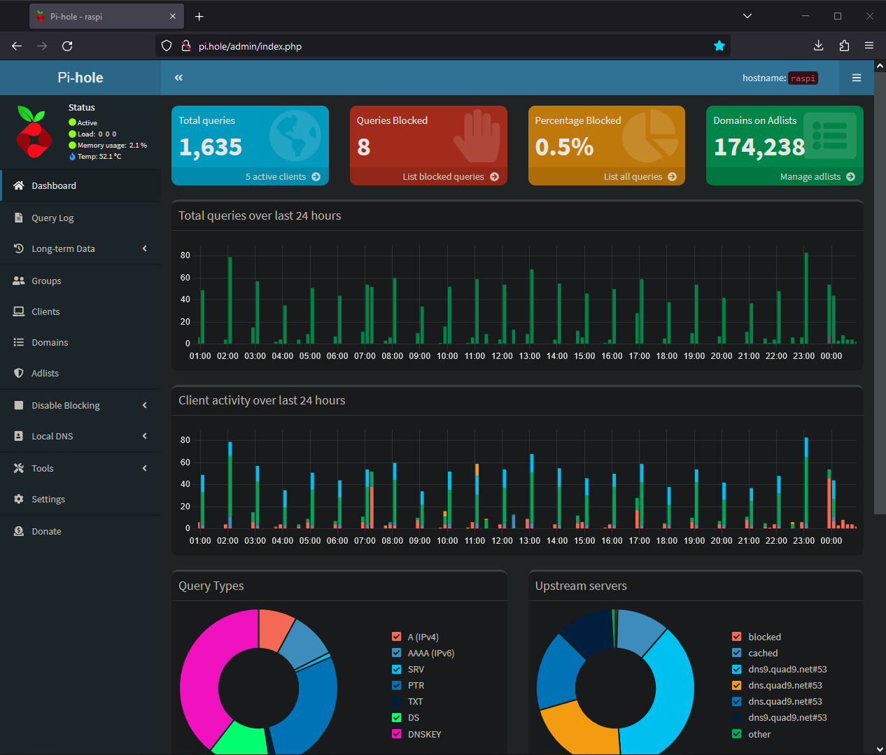
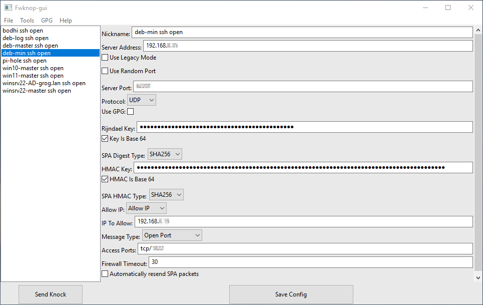
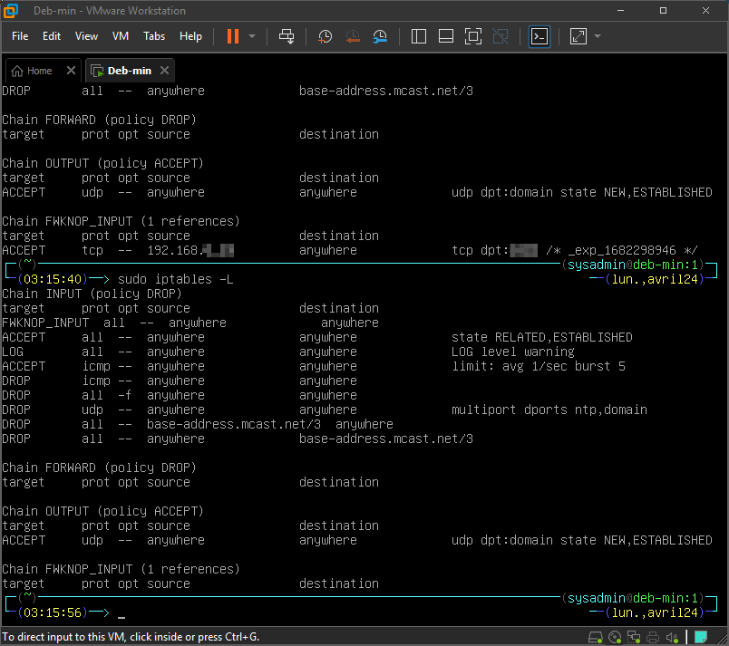
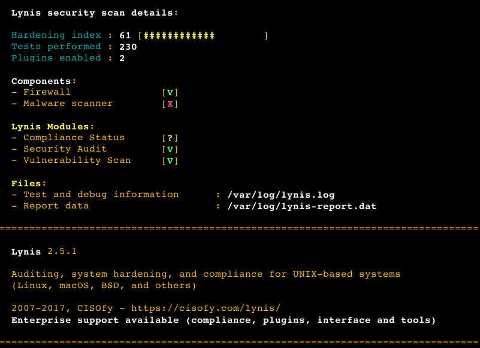

+++
archetype = "example"
title = "Réseau local"
weight = 1
+++

---

### Pi-Hole

Une capture d'écran après plusieurs mois d'utilisation :

---

### FwKnop

L'interface utilisateur sous Windows :

Ouverture et fermeture du port ssh par FwKnop dans iptables :

*Il faut initier la connexion ssh pendant que le port est ouvert, FxKnop refermant le port automatiquement à la fin du timeout défini. Si la connexion est effective, elle le reste une fois le port refermé.*

---

### Lynis

Audit, renforcement des systèmes, tests de conformité

Lynis est un outil de sécurité éprouvé pour les systèmes fonctionnant sous Linux, macOS ou Unix. Il effectue une analyse approfondie de l'état de santé de vos systèmes afin de soutenir le durcissement du système et les tests de conformité. Le projet est un logiciel open source sous licence GPL, disponible depuis 2007.

Lynis en cours d'audit :

Résultat :

*Après résolution de bon nombre d'avertissements en suivant les conseils prodigués, l'indice de durcissement de ma machine sous Linux Bodhi 6 a atteint un score de 85.*

---
