+++
archetype = "example"
title = "Serveur LAMPS"
weight = 3
+++

## Serveur LAMPS avec MediaWiki

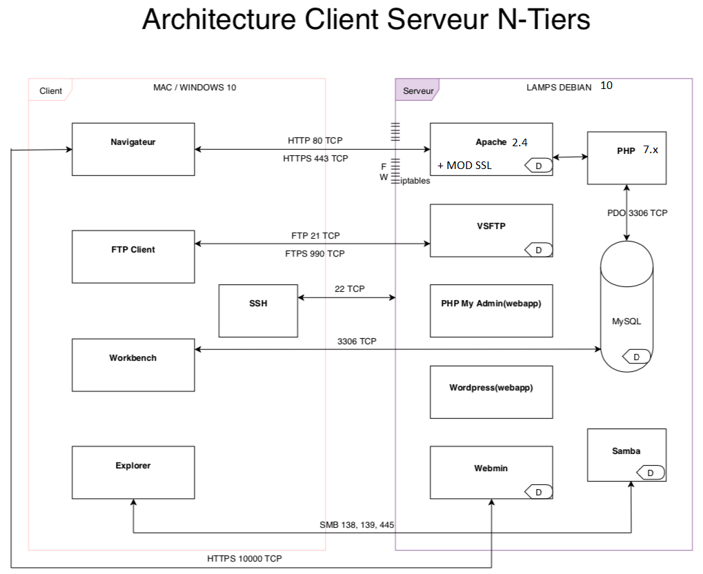
*Ici, nous installerons MediaWiki en lieu et place de Wordpress*

## 1 - Préambule

[cheat sheet linux](https://files.fosswire.com/2007/08/fwunixref.pdf)

Avoir une machine debian 11 en ip fixe avec :

- une connexion ssh
- .bashrc configuré
- (ssh) nmap zip dnsutils net-tools tzdata lynx sudo curl git screen locate ncdu
- la dernière version de webmin (finir l'installation avec apt -f install)
- winbind samba

Configurer :

- resolv.conf
- hosts
- hostname
- nsswitch
- timezone (dpkg-reconfigure tzdata)

*Sur Windows* : ajouter AdresseIp[TAB]fqdn dans le fichier `C:\Windows\System32\drivers\etc\hosts` de Windows **en Administrateur**

dans mon cas :

```bash
92.168.0.200  wiki.infra.lan
```

{}
***Choisir des mots de passe forts si utilisation en production.***
{}

## 2 - APACHE 2

### installation et configuration d'apache 2.4

```bash
apt install apache2
```

- activation du module SSL

```bash
a2enmod ssl
```

- activation du site SSL

```bash
a2ensite default-ssl
```

- relancer le service (systemctl restart apache2)

```bash
service apache2 restart
```

### - génération du certificat auto signé pour 10 ans

```bash
openssl req $@ -new -x509 -days 3650 -nodes -out /etc/apache2/apache.pem -keyout /etc/apache2/apache.pem
```

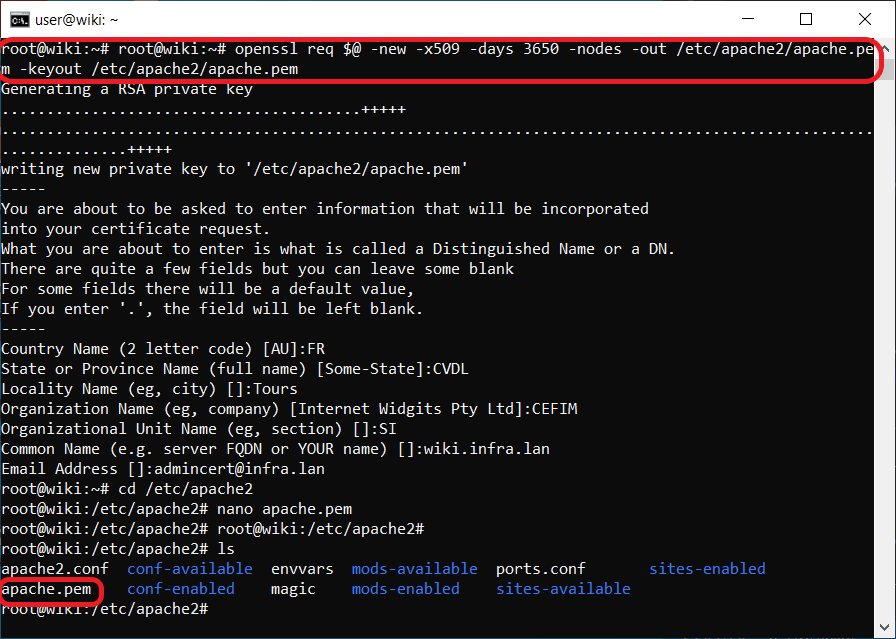

### - activation des modules populaires

```bash
a2enmod rewrite
a2enmod headers
```

### - écriture du nouveau certificat ssl dans la conf apache et changement du documentroot et redirection

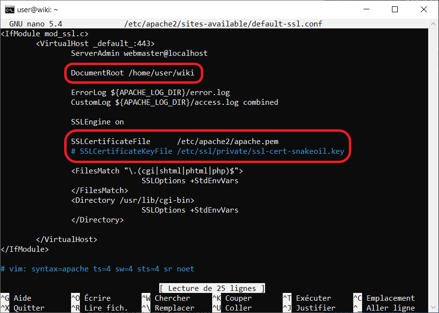

```bash
cd /etc/apache2/sites-available/
```

```bash
nano default-ssl.conf
```

### - nettoyage et redirection

(pour une meilleure lisibilité, on peut retirer les commentaires de 000-default.conf et default-ssl.conf)

```bash
nano /etc/apache2/sites-available/000-default.conf
```

```bash
<VirtualHost *:80>  
	Redirect Permanent / https://wiki.infra.lan  
</VirtualHost>
```

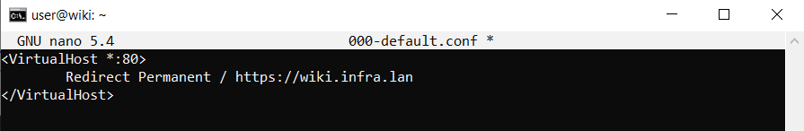

- redémarrer le serveur apache

```bash
service apache2 restart
```

- commenter la section <Directory /var/www/html>...</Directory> de apache2.conf

```
nano /etc/apache2/apache2.conf
```

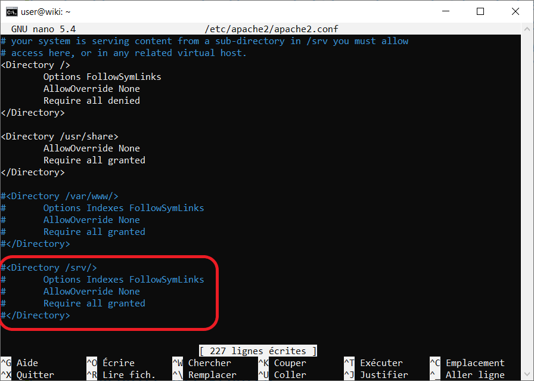

- création en mode user du dossier wiki et d’un index dans /home/user/

- débrayage temporaire en mode user pour la création

```bash
su user
mkdir /home/user/wiki
```

- créer du contenu dans index.html

```bash
nano /home/user/wiki/index.html
```

- repasser en root

```bash
su -
```

ou

```bash
exit
```

### - changement récursif de propriétaire et c'est apache le nouveau proprio

```bash
chown -R www-data:www-data /home/user/wiki
```

- ajout de user au groupe www-data

```bash
usermod -aG www-data user
```

- changement récursif des droits pour le dossier wiki pour ftp et samba

```bash
chmod -R 775 /home/user/wiki
```

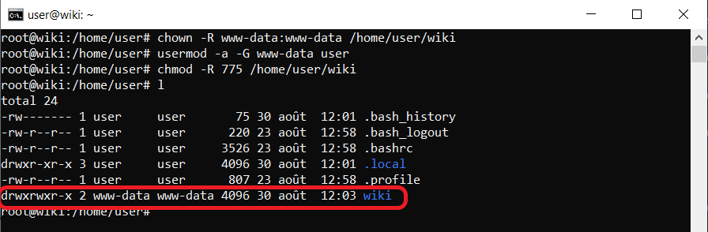

```bash
service apache2 restart
```

### - fusion des 2 fichiers de conf

- copier le contenu des 2 fichiers de conf (000 et default ssl) dans un seul fichier dans sites-available nommé site.conf

```bash
cd /etc/apache2/sites-available
cat 000-default.conf > site.conf
cat default-ssl.conf >> site.conf
```

- désactivation des 2 fichiers de conf qui ne vont plus servir

```bash
a2dissite 000-default
a2dissite default-ssl
```

- effacement de ces 2 fichiers

```bash
rm 000-default.conf
rm default-ssl.conf
```

- activation de la nouvelle et unique conf

```bash
a2ensite site.conf
```

- ajout de la section <Directory... </Directory> dans site.conf qui doit maintenant ressembler à ça :

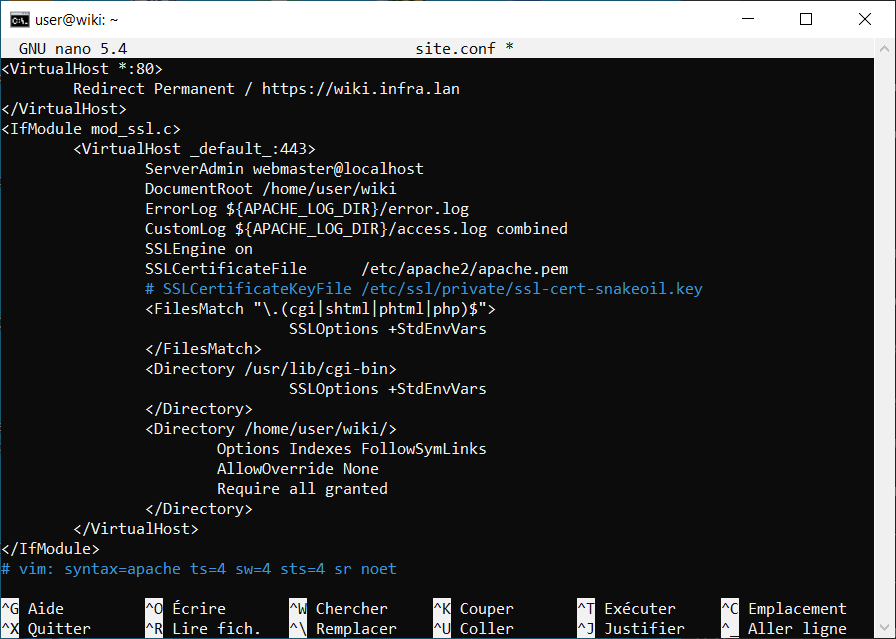

```bash
service apache2 restart
```

**à ce stade la page html doit s'afficher dans le navigateur de Windows à l'adresse https://wiki.infra.lan**

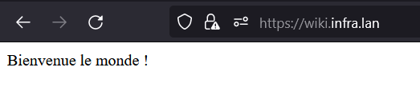

## 3 - MySQL

### Installation et configuration de MySQL

- installation de mysql8 en lieu et place de maria

```bash
wget https://repo.mysql.com/mysql-apt-config_0.8.23-1_all.deb
dpkg -i mysql-apt-config_0.8.23-1_all.deb
```

> Sélectionner 'MySQL Server & Cluster...' + [entrée]

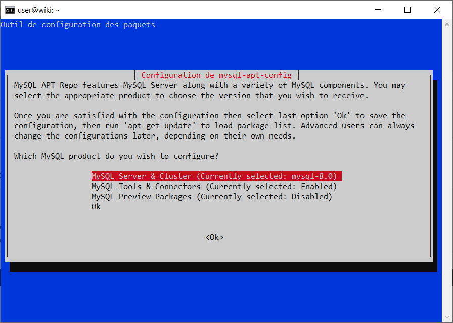

> Sélectionner 'mysql-8.0' + [entrée]

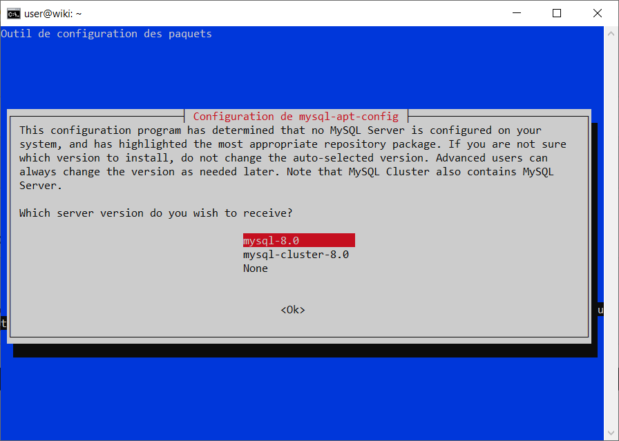

> Sélectionner 'Ok' dans la liste + [entrée]

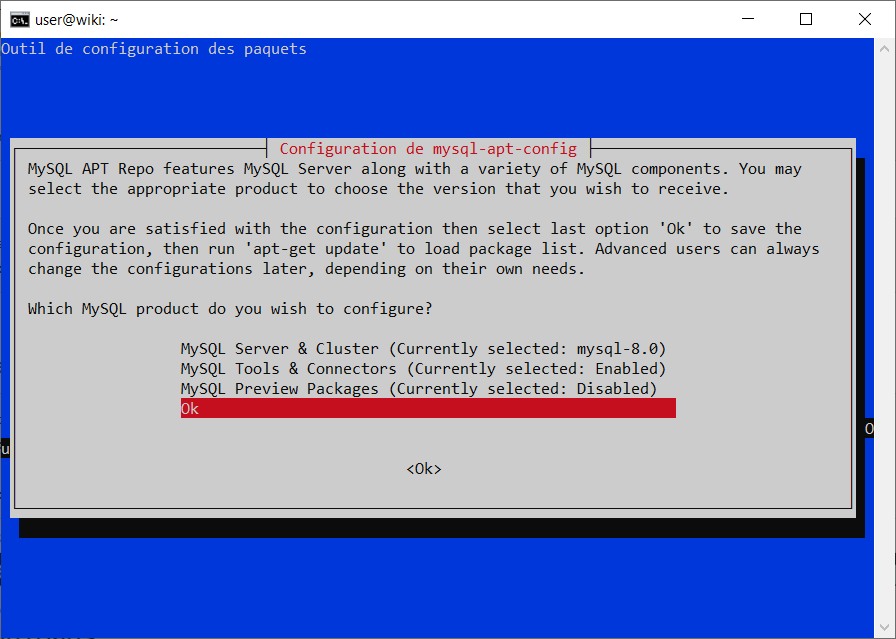

```bash
apt update
apt upgrade
apt install mysql-server
```

- indiquer le mot de passe pour l'accès à mysql en root et confimer à l'écran suivant

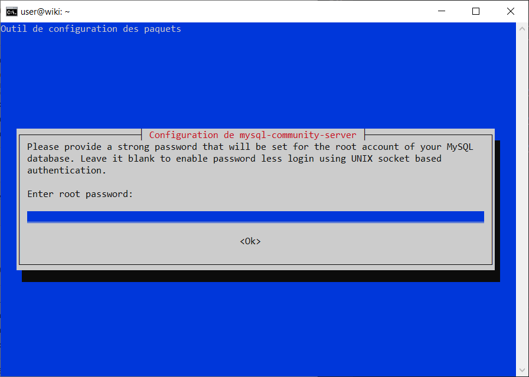

> choisir l'option recommandée (strong password encryption) + [entrée]

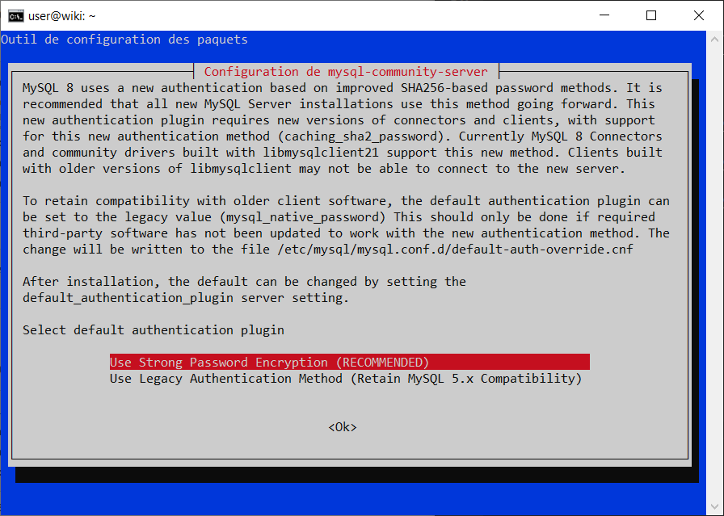

- test de mysql en CLI

```bash
mysql -u root -p
```

puis entrer le mot de passe choisi juste avant

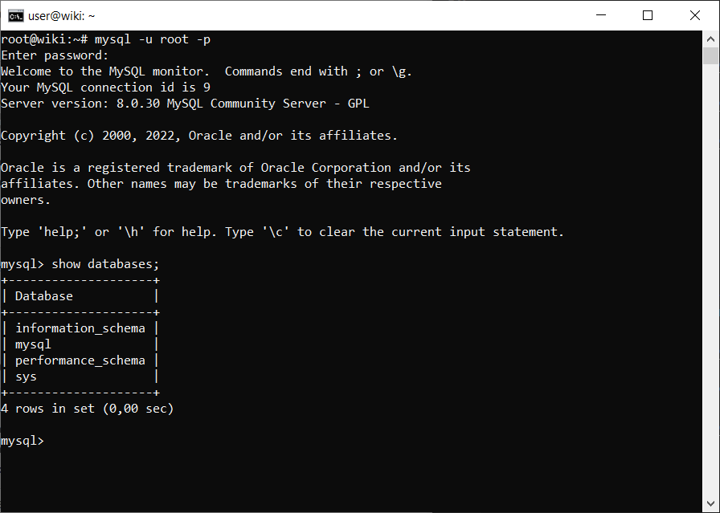

`exit` pour sortir 

## 4 - PHP

### Installation et configuration du langage PHP 7.x

- installation PHP 7.4 sur deb 11

```bash
apt install php
```

- édition du fichier php.ini pour modifier le upload max filesize

```bash
nano /etc/php/7.4/apache2/php.ini
```

*pour faire une recherche dans nano :
tapper ctrl+w et entrer le texte à rechercher (upload_max) puis entrée*

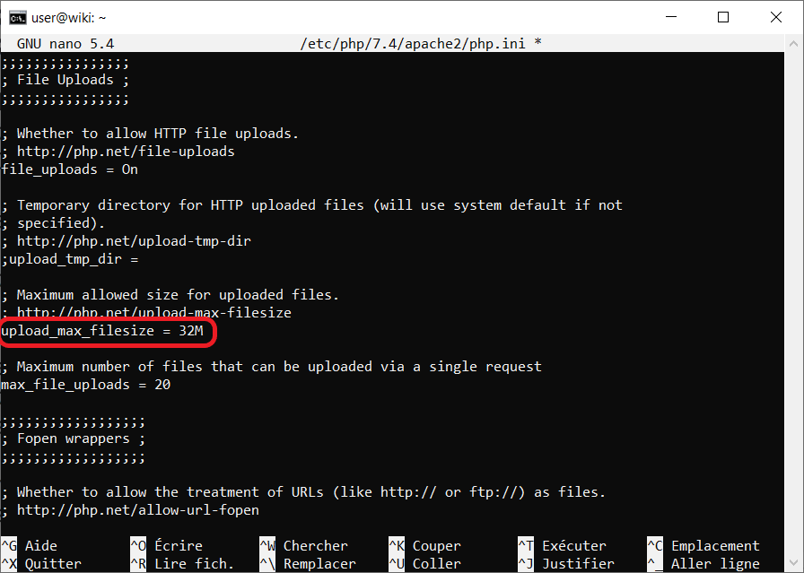

- redémarrer le service apache2

```bash
service apache2 restart
```

### création d’un fichier info dans /home/user/wiki/ nommé info.php avec le compte user

```bash
su user
```

```bash
nano /home/user/wiki/info.php
```

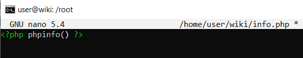

- repasser en root

```bash
su -
```

ou

```bash
exit
```

- lancer un navigateur sur https://wiki.infra.lan/info.php

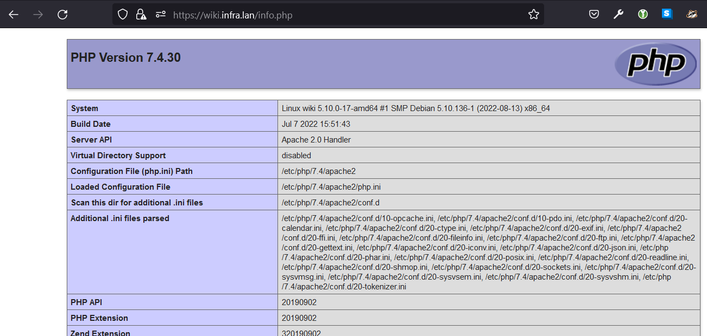

### installation des libs PHP souvent utilisées par les cms

```bash
apt install php-curl php-gd php-zip php-apcu php-xml php-ldap php-mbstring
apt install php-mysql
```

- recharger apache2

```bash
service apache2 restart
```

## 5 - PhpMyAdmin

### Installation et configuration de PhpMyAdmin

- installation de PhpMyAdmin

```bash
apt install phpmyadmin
```

**ATTENTION** : à la page de sélection du serveur web, appuyer sur [espace] pour sélectionner 'apache2' avant de valider :

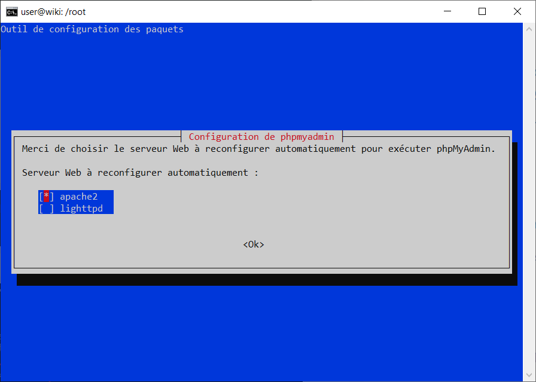

> répondre OUI pour utiliser dbconfig-common

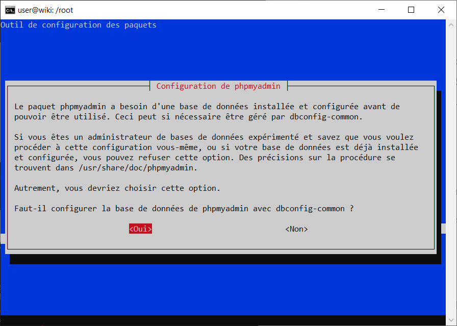

> entrer un mot de passe pour PhpMyAdmin dans mysql et confirmer à l'écran suivant

> entrer un mot de passe pour l'administrateur de PhpMyAdmin

- et voir ce [lien](https://www.digitalocean.com/community/questions/how-do-i-change-phpmyadmin-access-url) pour l'alias (pour accéder à PhpMyAdmin via pma) => 

```bash
nano /etc/phpmyadmin/apache.conf
```

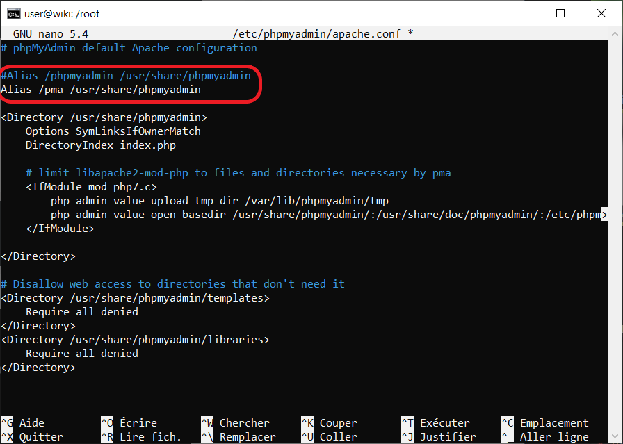

- recharger apache2

```bash
service apache2 restart
```

### Changement des droits root avec %

- se connecter en root sur phpmyadmin sur un navigateur à l'url https://wiki.infra.lan/pma

- dans le cadre de gauche, déplier l'entrée mysql et sélectioner la table 'user'

- dans la ligne 'root' du cadre principal, entrer % à la place de localhost

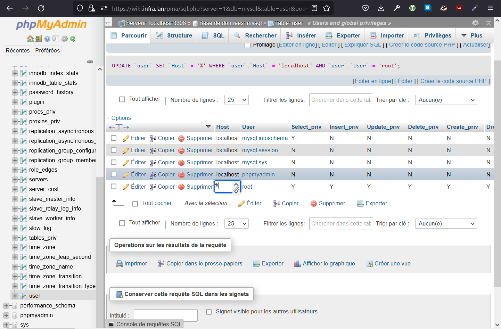

### Création via PMA dans MYSQL d'un utilisateur 'user' qui aura tous les droits sur la base 'user' mais pas ailleurs

- aller à l'accueil de pma

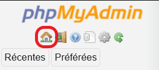

- cliquer sur l'onglet 'Comptes utilisateurs' puis le lien 'Ajouter un compte utilisateur'

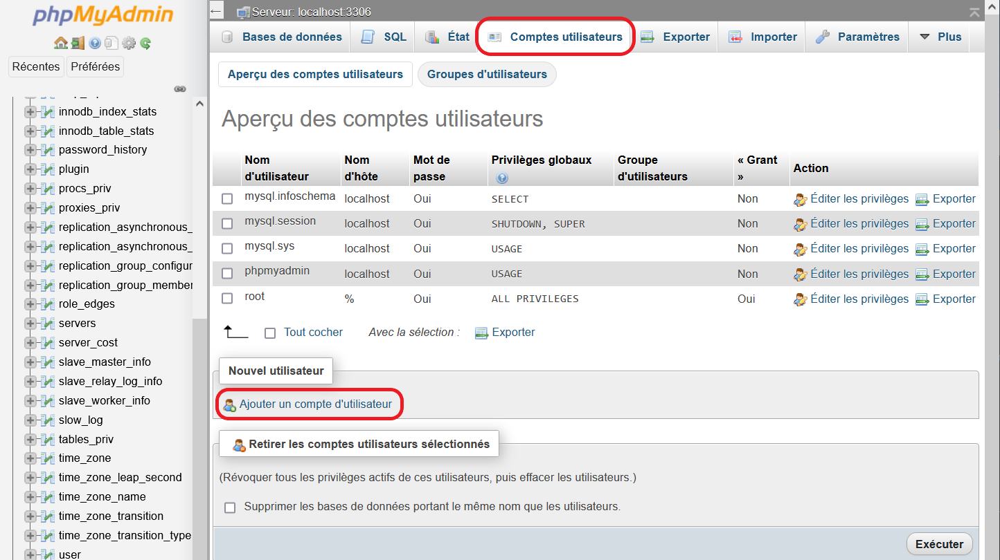

- saisir le nom d'utilisateur et son mot de passe + confirmation puis activer la case à cocher 'Créer une base portant son nom...' et rien d'autre. Cliquer le bouton 'Exécuter' tout en bas à droite de la page.

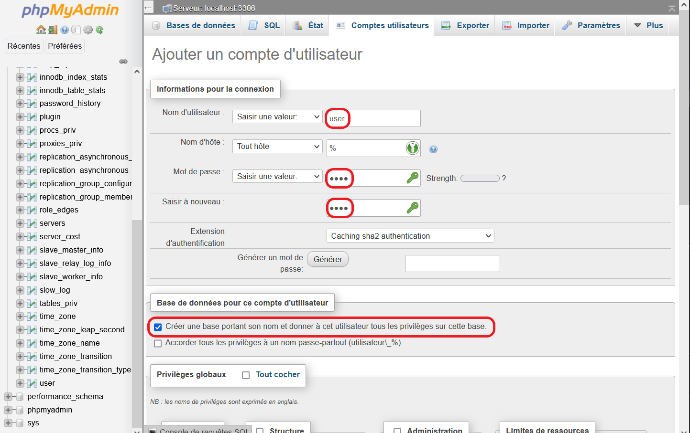

- Recharger les privileges (droits) via la zone de texte de l'onglet SQL en saisissant la commande :

```sql
FLUSH PRIVILEGES;
```

- Se déconnecter en haut à gauche et tester les droits du nouvel utilisateur

## 6 - FTP

### Installation et configuration du service FTP

- installation du service ftp

```bash
apt install vsftpd
```

- copie de sauvegarde de /etc/vsftpd.conf avant édition

```bash
mv /etc/vsftpd.conf /etc/vsftpd.bak
```

- configuration du service avec chrootage, passv et ssl

```bash
nano /etc/vsftpd.conf
```

[Un exemple de fichier vsftpd.conf](vsftpd.conf.txt) (ici renommé en .txt pour en faciliter la lecture)

```bash
service vsftpd restart
```

```bash
nmap 127.0.0.1
```

```bash
nmap votre_ip
```

```bash
service vsftpd status
```

- se connecter en sftp avec filezilla client

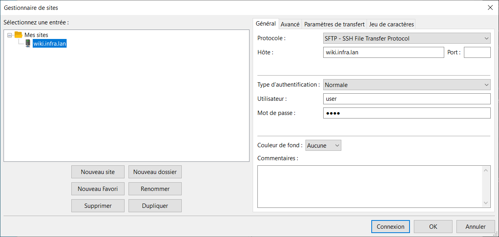

## 7 - SAMBA

### Installation et configuration du partage SAMBA

- config de samba (samba pré-installé en amont)

```bash
cp /etc/samba/smb.conf /etc/samba/smb.bak
```

```bash
nano /etc/samba/smb.conf
```

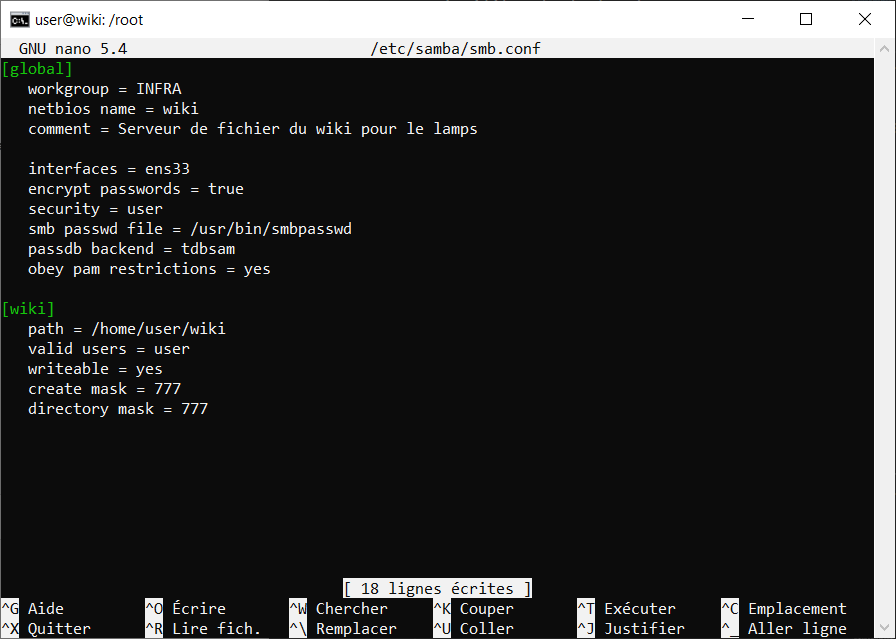

- relancer les 2 services

```bash
service nmbd restart
service smbd restart
```

- tester notre fichier de conf

```bash
testparm
```

- chiffrer le user de la base de compte local Linux à la sauce windows

```bash
smbpasswd -a user
```

### il n' y a plus qu'à tester via l'explorateur de fichier avec

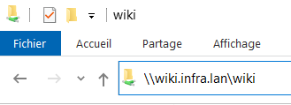

## 8 - Script de sauvegarde des bases de données

***Le but est de créer une tâche automatique qui compresse en zip le dossier contenant les bases et qui le sauve dans un dossier à la date du jour ainsi que le contenu du dossier wiki***

- on crée le script dans /root

```bash
cd /root
touch backup.sh
```

- on lui donne les droits d'exécution

```bash
chmod +x backup.sh
```

- on l'édite

```bash
nano backup.sh
```

avec :

```bash
#!/bin/bash  
#Scipt de backup auto de la BDD et du wiki pour le site user  
#V1.0 par UserName le Date  
clear  
echo Compression des fichiers...  
7zip -rq /home/user/$(date +%Y%m%d%H%M%S)_wiki_backup-fichiers.zip /home/user/wiki  
echo Dump de la base de données...  
mysqldump -u root -p 'toor' --databases user > /home/user/_wiki_backup-base.sql  
echo Compression de la base de données...  
zip -q /home/user/$(date +%Y%m%d%H%M%S)_wiki_backup-base.zip /home/user/_wiki_backup-base.sql  
rm /home/user/_wiki_backup-base.sql  
echo Terminé !
```

(La chaine 'toor' est le mot de passe de root sur mysql. Choisir un MDP fort pour un usage en production)

### Pour tester le script

```bash
cd /root
./backup.sh
```

ou plus simplement

```bash
/root/backup.sh
```

### Pour automatiser ce script :

```bash
crontab -e
```

- choisir [1] pour ouverture avec nano

### rajouter la ligne (cf [http://crontab.guru](http://crontab.guru))

> */5 * * * * /root/backup.sh

- cette directive exécute le script toutes les 5 minutes

## 9 - Installation du certificat dans Webmin

Dans un navigateur, accéder à l'url : [https://wiki.infra.lan:10000](https://wiki.infra.lan:10000) et se connercter avec root

Puis dans Webmin > Webmin Configuration > SSL encryption (version en) :

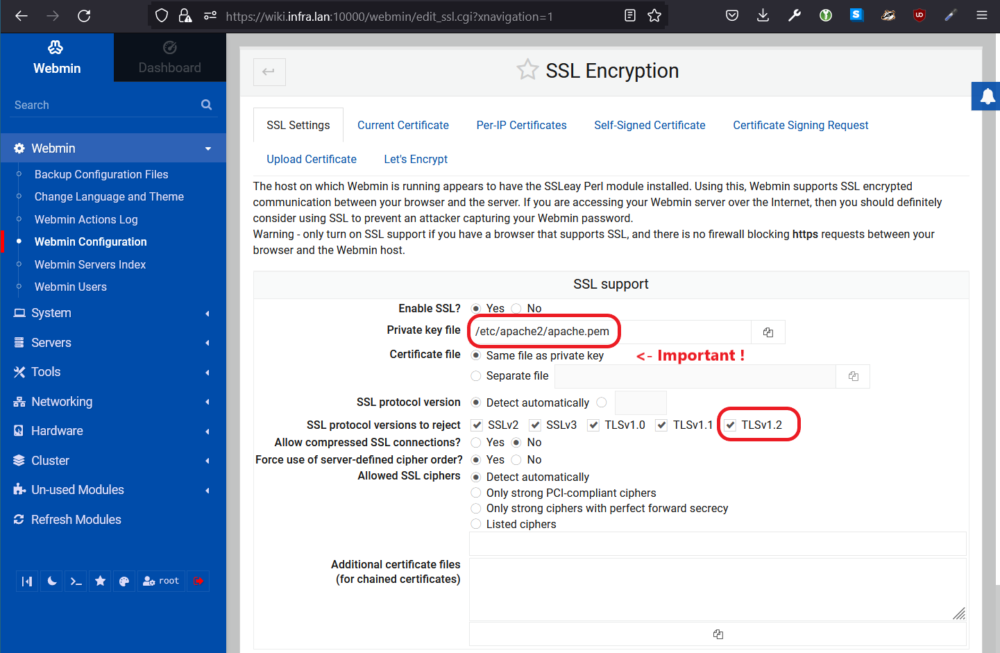

Appliquer les changements en cliquant le bouton 'Save' en bas à gauche de la page ; attendre quelques secondes puis recharger la page.

## 10 - MediaWiki

### installation de MediaWiki

- installation de l'extention PHP intl (requise pour MediaWiki)

```bash
apt install php-intl
service apache2 restart
```

- installation de MediaWiki

```bash
cd /home/user
wget https://releases.wikimedia.org/mediawiki/1.38/mediawiki-1.38.2.zip
unzip mediawiki-1.38.2.zip
rm -R wiki
mv mediawiki-1.38.2 wiki
chown -R www-data:www-data /home/user/wiki
chmod -R 775 /home/user/wiki
```

### Terminer l'installation de MediaWiki via le navigateur

- Dans le navigateur, aller à [https://wiki.infra.lan](https://wiki.infra.lan)

- cliquer sur le lien proposé pour démarrer l'installation

- à la page 'Connexion à la base de données', choisir :
  
>- *Type de base de données* : MariaDB, MySQL , ou compatible
>- *Nom d’hôte de la base de données* : localhost
>- *Nom de la base de données (sans tirets)* : user
>- *Préfixe des tables de la base de données (sans tirets)* : mw_
>- *Nom d’utilisateur de la base de données* : user
>- *Mot de passe de la base de données* : le mot de passe pour user défini plus haut dans PhpMyAdmin

- à la page 'Nom', nommer le wiki (ie : wiki infra.lan) ; c'est le nom qui figurera dans la barre de titre du navigateur ; puis renseigner un utilisateur qui sera administrateur du wiki (MDP 10 caractères minimum)

- On peut s'arrêter là pour cet exemple. Il est néanmoins possible de spécifier des greffons supplémentaires en poursuivant l'installation.

- Un fichier (LocalSettings.php) est généré et téléchargé par le navigateur. Il doit être copié à la racine wiki (dossier /home/user/wiki) avec Filezilla ou Samba. Si problème d'écriture dans le dossier wiki, ressaisir les 3 commandes chown, usermod et chmod de la section apache telles que décrites au début de ce document.
  
```bash
chown -R www-data:www-data /home/user/wiki
usermod -a -G www-data user
chmod -R 775 /home/user/wiki
```

## Le wiki est opérationnel sur [https://wiki.infra.lan](https://wiki.infra.lan)

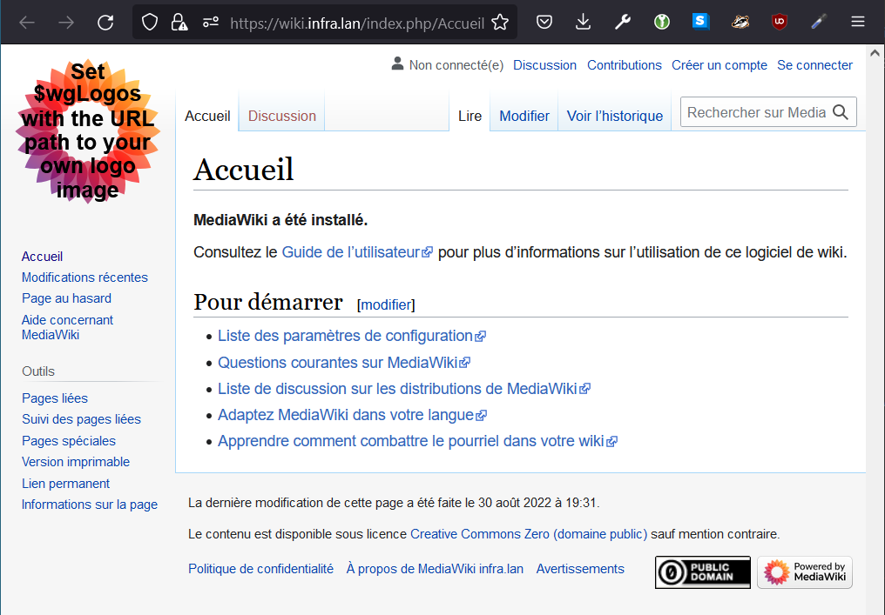

On peut consulter la base de donnée en se connectant avec user à PhpMyAdmin sur [https://wiki.infra.lan/pma](https://wiki.infra.lan/pma) : l'installation de MediaWiki a généré 58 tables.

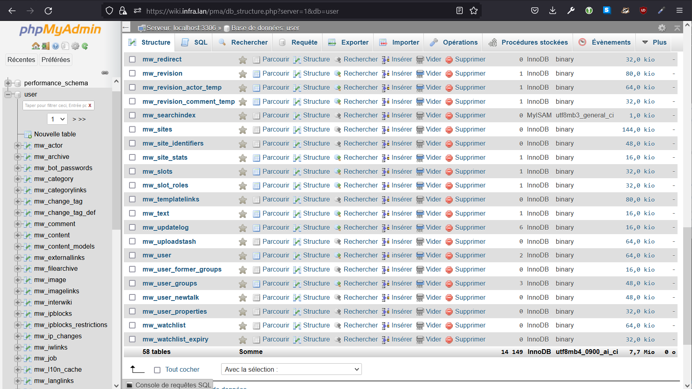

