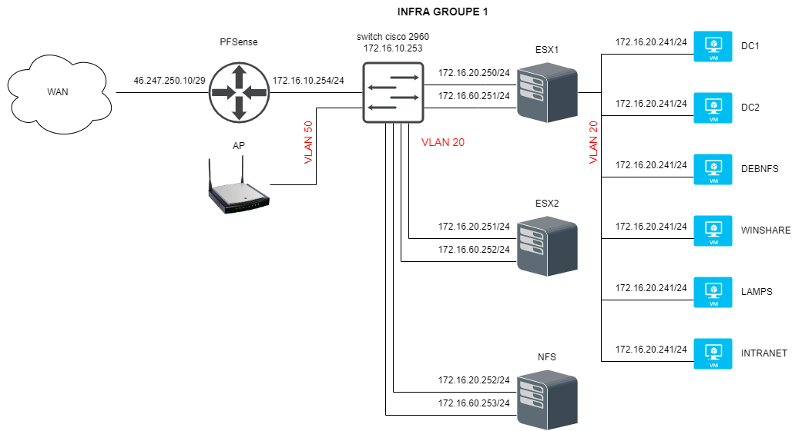
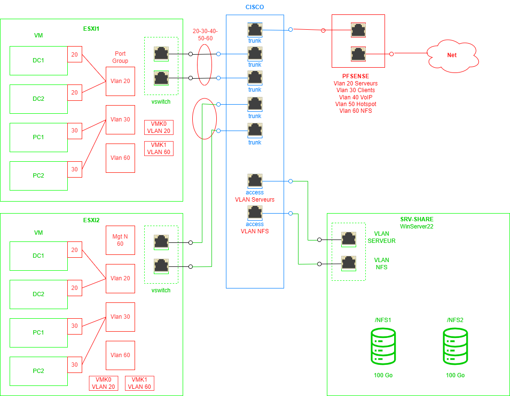

+++
archetype = "example"
title = "TP Infra"
weight = 4
+++

## TP infra en cluster ESXi

Voici les schémas réseaux du TP infra dirigé par Karl Fricker

---

|**CHECKLIST**||
|-|-|
|**ROUTEUR /GTW**||
|Installation d'un PFSense|VRAI|
|Configuration du WAN|VRAI|
|Configuration du LAN en classe B/24|VRAI|
|Définir les interfaces optionnelles pour chaque VLAN|VRAI|
|Les clients derrière le routeur ont internet|VRAI|
|Configuration de l'accès en https only sur le port 666|VRAI|
|L'équipement est pinguable via un FQDN pertinent ou son alias|VRAI|
|Définir un SSID petinent avec une shared key WPA2|VRAI|
|L'équipement est pinguable via un FQDN pertinent ou son alias|VRAI|
|Sécuriser l'équipement|VRAI|
|||
|**ESXi**||
|Installation d'un ESXi 7 sur une machine hôte physique|VRAI|
|1 datastore local est configuré|VRAI|
|A minima deux cartes réseaux sont configurées|VRAI|
|Les VMS ne passent pas toutes par la même IF|VRAI|
|L"ESXI peut s'authentifier sur le LDAP de DC1|FAUX|
|L'équipement est pinguable via un FQDN pertinent ou son alias|VRAI|
|||
|**DC1**||
|un domaine du type toto.lan a été crée|VRAI|
|la zone reverse est crée|VRAI|
|Les roots servers DNS sont à jour|VRAI|
|Un redirecteur vers 1.1.1.1 est créé|VRAI|
|1000 users ont été déposés dans une OU sur DC1 via un script powershell (me demander si besoin)|VRAI|
|A minima un client peut joindre le domaine|VRAI|
|La console Sites & Service a été configuré pour une réplication à 15 minutes|VRAI|
|La console Sites & Service a été configuré pour un subnet classe B/25|VRAI|
|La console Sites & Service a été configuré pour rédéfinir le default-first-site|VRAI|
|L'équipement est pinguable via un FQDN pertinent ou son alias|VRAI|
|||
|**DC2**||
|Le rôle active directory est installé|VRAI|
|Le DC2 réplique les users du DC1|VRAI|
|Le DC2 fait également la bascule DNS|VRAI|
|L'équipement est pinguable via un FQDN pertinent ou son alias|VRAI|
|||
|**SHARE**||
|La console quotas et filtre est installé|VRAI|
|Chaque utilisateur possède un quota de 500 Mo|VRAI|
|On ne peut pas déposer de fichier MP3 sur ce partage|VRAI|
|Un dossier commun est disponible pour tout le monde en R/W|VRAI|
|Un dossier perso est disponible en R/W pour chaque User|VRAI|
|Dans chaque poste client via une GPO on doit pouvoir propager le mappage des lecteurs de partage|VRAI|
|L'équipement est pinguable via un FQDN pertinent ou son alias|VRAI|
|||
|**SWITCH**||
|On peut y accéder par un cable console|VRAI|
|On peut y accéder par l'interface web sur une IP Fixe si il le permet|VRAI|
|les vlans y sont configurés comme vu en cours packet tracer|VRAI|
|les deux IF de l'ESXI sont sur chaque switch|VRAI|
|Le switch cisco est réinitialisé|VRAI|
|L'équipement est pinguable via un FQDN pertinent ou son alias|VRAI|
|||
|**GLPI**||
|Installer un debian 10/11 sur une VM|VRAI|
|Installer un LAMPS|VRAI|
|Installer la webapp GLPI|VRAI|
|L'équipement est pinguable via un FQDN pertinent ou son alias|VRAI|
|Configurer GLPI pour offrir un helpdesk de base|VRAI|
|Configurer un connecteur LDAP|VRAI|
|Ouvrir un workflow de ticket pour un user|VRAI|
|||
|XIVO IPBX||
|Installer la dernière distribution de XIVO|VRAI|
|Configurer une entité|FAUX|
|Configurer un plan d'adressage locale de numérotation entre 100 et 199|FAUX|
|L'équipement est pinguable via un FQDN pertinent ou son alias|FAUX|
|Installation des greffons pour les ciscophone et les des polycom|FAUX|
|Création de 6 comptes utlisateurs|FAUX|
|Installation sur android/IOS de zoiper ou Jitsi|FAUX|
|Installation sur client windows de zoiper|FAUX|
|La communication en interne est possible|FAUX|
|Le XIVO fait DCHP pour le VLAN|FAUX|
|Configurer un connecteur LDAP|FAUX|

- *La machine Xivo n'a pas été terminé faute de temps et d'une mauvaise manipulation en fin de TP.*

---
