+++
archetype = "example"
title = "Migrations Active Directory"
weight = 1
+++

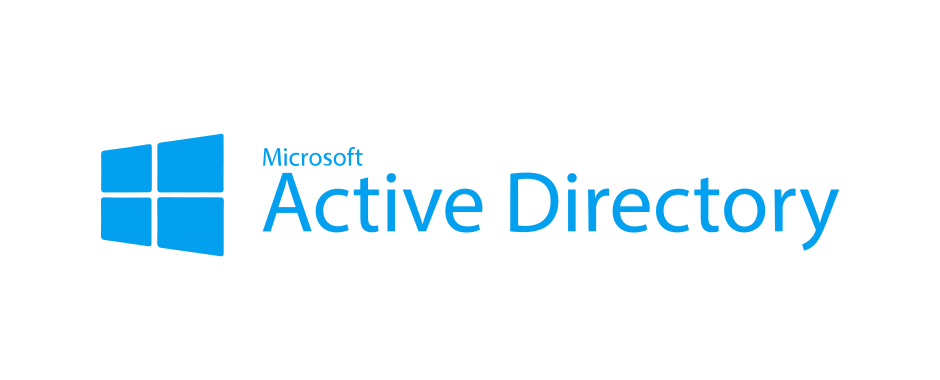

## Introduction

Entreprise : 2 DNS : interne et externe  
L'AD et le DNS sont fusionnés en entreprise.  
L'AD est le rôle principal dans une entreprise, il permet la sécurité, l'authentification utilisateur. On y retrouve les comptes, les mdp, les groupes, les serveurs.  
C'est le noyau d'une infrastructure système. Tout tourne autour de lui.  
C'est grâce à l'AD qu'on peut faire du SSO (jeton pour la "journée" d'authentification). 

## DNS  

|DNS exterieur|DNS interne lié à l'AD|
|:-:|:-:|
|(**1**) FAI > pool IP publique + ligne internet|(1)Onglet redirecteur : les 2 IP publique des DNS externes (pour rebalancer si non connnu en interne)
|NAT IP internet vers IP publique|
|(**2**) Fournisseur nom de domaine > DNS public + zone DNS exterieure|
|Mep lien DNS publique sur IP publique|mep lien vers IP privées/internes sur enregistrements et noms
|A (nom>ip), TXT, MX (*mail*), PTR (*reverse A ; pas de pointeurs dans un server DNS publique*), NS (*server DNS*), SOA (e*nr principal dns*), CNAME (*autre nom*)|Idem : A, TXT, MX, PTR, NS, SOA, CNAME
|Zone DNS ext = on fait pointer IP publique vers ex. `intranet.tssr.net`|IP privée ( (**a**) `192.168.20.240 srv.web)` > `.lan` (`srv.web.lan`) en record A,  (**b**) CNAME > vers le `.lan` (`intranet serv.web.lan`) OU (**c**) enregistrement zone A directement `icp.fr > intranet.icp.fr` comme ça que ce soit en interne/externe, accès au serveur avec la même nomenclature)

Les enregistrements sont les mêmes pour les zones DNS internes et externes.

**PROGRAMME:**
- Monter une AD unique à nous tous, faire tout ce qu'on va retrouver en entreprise (ex: comptes, groupes, mdp, OU); les bonnes pratiques.
- On fera des GPO qui sont le plus utilisées en entreprise.
- Sécurité NTFS (sécurité sur les dossiers et les fichiers). 

## ACTIVE DIRECTORY

*AD = LDAP (LDAPs = fonction sécurisé) = Annuaire = Annuaire d'identité*

Port AD 389 / Port LDAS 636

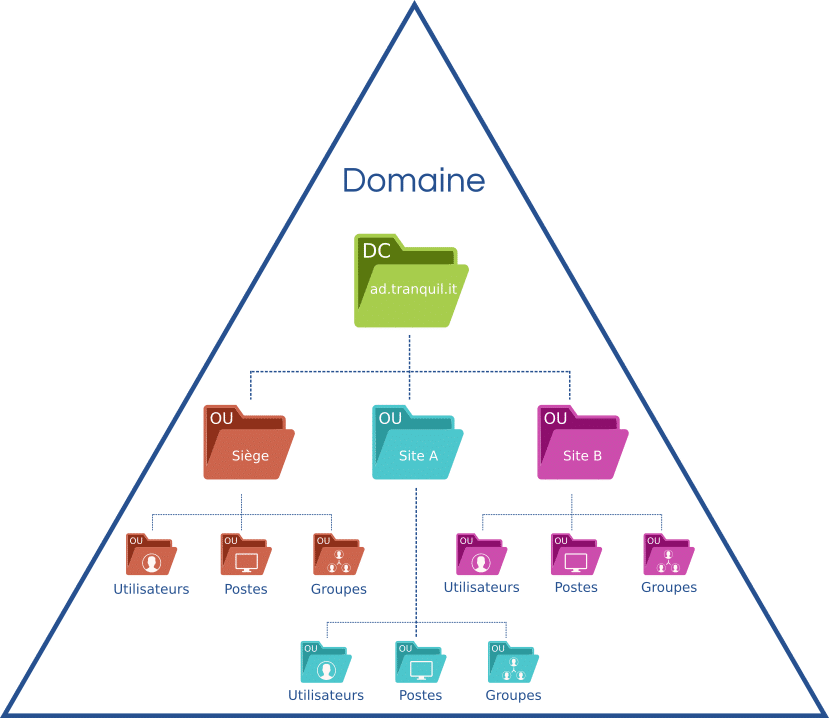

AD => c'est une forêt => la forêt c'est le schéma qui est rempli d'attributs.
Dans cette forêt, il peut y avoir des domaines, voire des sous-domaines des domaines.
En entreprise, pour éviter de complexifier son AD, on ne fait qu'un domaine, voir deux sous-domaines (messagerie et compte). On peut même simuler des sous-domaines pour ne pas complexifier l'AD. Grâce à cela on n'a qu'un seul et unique domaine à gérer.
Le login côté AD s'apelle l'UPN (équivalent de l'adresse mail)  
AD permet de gérer: les comptes génériques, mdp, groupes de sécurité, listes de diffusion, machines, serveurs, GPO, BALS (implicitement c'est un compte / BALS: Boite aux lettres) générique, BALS équipements, BALS Salle.  

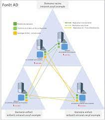

Les 5 étapes de l'installtion d'un magnifique serveur neuf :

- Configurer un RAID
- Installation Windows Server  
- Configuration carte réseau (no DHCP, tout est fixé)  
- Faire les MàJ Microsoft  
- Antivirus

**Les SERVEUR AD sont les CONTROLEURS DE DOMAINES**  
Ils sont aussi serveurs DNS externes.  
Les bonnes pratiques :

- Ce sont deux serveurs par site. Un contrôleur de domaine ne doit rien faire d'autre.  
- Ils doivent être physiques. À la limite, un des deux peut être virtualisé (au cas ou l'infra VMware crash)  
- Le principal doit rester en physique. Il héberge les rôles FSMO.
- La réplication AD permet de synchroniser dans les 15 minutes tous les contrôleurs de domaine.  

Dans le cas d'un multi site :

|Paris| |Marseille| |Lyon| |Clermont|
|:-:|:-:|:-:|:-:|:-:|:-:|:-:|
|DC Prinicpal / DC Secondaire| --> VPN IPSEC SITE A SITE --> |DC Secondaire / DC Secondaire| --> VPN IPSEC SITE A SITE --> |DC Secondaire / DC Secondaire| --> VPN IPSEC SITE A SITE --> |DC Secondaire / DC Secondaire|
||Replication AD dans le tunnel||Replication AD dans le tunnel||Replication AD dans le tunnel|
||Ad src 172.16.0.0/24 vers ad dest 172.30.0.0/24||Ad src 172.30.0.0/24 vers dest 172.62.0.0/24||Ad src 172.62.0.0 vers ad dest 172.16.0.0/24|

**Bonne pratique** :  
Les 4 sites sont reliés en VPN IPSEC site à site.  
Sur de l'intersite, faire passer la réplication AD dans le tunnel.  
Tout les Firewalls proposent le VPN IPSEC site à site. Les configurer exterieurement (sur Paris, mettre l'Ip publique de Marseille, ainsi que les méthodes d'encryption. Il faut qu'elle soit égale des 2 côtés. Idem pour la clé secrete partagée).  
Mettre la même marque de firewall sur tout ces sites*

## AD SUR WINDOWS SERVEUR 2019

### Construire un contrôleur de domaine principal

- Gérer "Ajout de rôles et des fonctionnalités"
- Assisstant Ajout de rôles :
  - Rôles de serveurs
  - Cocher Service AD DS (Gestion de Stratégie de Groupe déjà coché)
  - Lancer l'installation du rôle
- Drapeau Orange en haut à droite "Promouvoir ce serveur en contrôleur de domaine"
- Assistant de Configuration des services de domaines AD
  - Configuration de déploiement
    - "Ajouter une nouvelle forêt"
    - Nom de domaine racine "om.lan"
  - Options du contrôleur de domaine
    - Serveur DNS : laissé coché
    - Catalogue Global (rôle de base)
    - Mot de passe: dadfba16$
  - Options supplémentaires
    - il le déduit seul "OM"
  - Chemin d'accès
    - On retrouve le chemin de l'enregistrement de la BDD.
    - *Bonne Pratique: sauvegarder les logs sur une partition D*
  - Lancer l'installation

L'AD se crée. Cela crée le schéma, la forêt, les FSMO.  
Sur un contrôleur de domaine, lorsque le domaine est crée, la notion d'Admin local, c'est terminé. On rentre obligatoirement en ADMINISTRATEUR DU DOMAINE.  

**Vérification et première configuration**

- La première chose à faire c'est de modifier le DNS de la carte réseau du serveur. On met l'adresse Ip de lui-même car à partir de maintenant il est aussi serveur DNS.

- **Outils Administration, Utilisateur et Ordinateurs Active Directory**
  - On verifie .... et catalogue global.
  - Clique-droit, Maitre d'opération :
     On a les 3 rôles FSMO

- **Outils Administration, DNS**
  - On vérifie que notre domaine est créé en zone directe.
  - Si notre zone reverse n'est pas créée, il faut la créer.
    - clique-droit, ajouter une nouvelle zone.  
    - Ajouter le pointeur PTR du Record A de la zone directe.  
  - Clique-droit, Propriété sur le serveur DNS
    - Ajouter nos DNS de FAI dans l'onglet Redirecteurs
  - ***Cela permet à l'exterieur (l'internet) de pointer vers le serveur interne.***

- **Outils Administration, Sites et Services Active Directory**
  - Default-First-Site-Name
    - C'est le site sur lequel vous avez mis le controleur de domaine principal.  
    - On retrouve les contrôleurs de domaine rattachés à ce site.  
  - Inter-Site-Transports
    - IP => DEFAULTIPSITELINK : C'est le moteur de réplication entre les contrôleurs de domaine. 
      - Clique-droit, Propriété et mettre la réplication à 15 min.  
  - Subnets (Le plus important ! Il faut déclarer le réseau du site et le rattacher au site.)
    - Clique-droit, Nouveau sous-réseau
      - Préfixe: 192.168.20.0/24 et séléctionner le site
  - Clique-droit sur Sites, Ajouter un nouveau site. (Par exemple Marseille). Penser à créer le subnet du réseau de Marseille.

- **Outils Administration, Domaine et Approbation Active Directory**
  - Clique-droit, Propriété sur le Domaine et approbation AD.
    - On peut simuler des créations de sous-domaines ou des domaines.  
    - ***Si on ajoute un nouvel utilisateur, on peut lui créer son identifiant avec la partie mail que l'on veut.***

- **Outils Administration, Modèles ADSI**
  - Ici on a la retranscritpion de notre AD coté Forêt (CN = attribut)
  - C'est le coeur de l'AD

***ATTENTION***
| DNS | Suffixes UPN |
|:-:|:-:|
| bobdy.lan | bobdy.com / bobdy.fr |
| zone directe: bobdy.com ou bobdy.fr | cela peut être les mêmes |
| SERVEUR | MESSAGERIE/IDENTIFIANT |
| Dans le DNS interne (voir externe) | Dans l'Active Directory |

### Préparer le contrôleur de domaine secondaire

- 1ère chose : mettre l'IP du contrôleur principal dans les paramêtres de cartes réseau.  
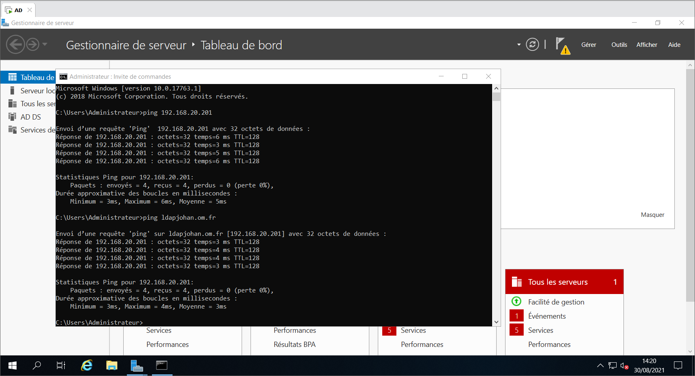
- 2éme chose : ajouter le domaine (On arrive dans les "computers" sur le contrôleur principal)  
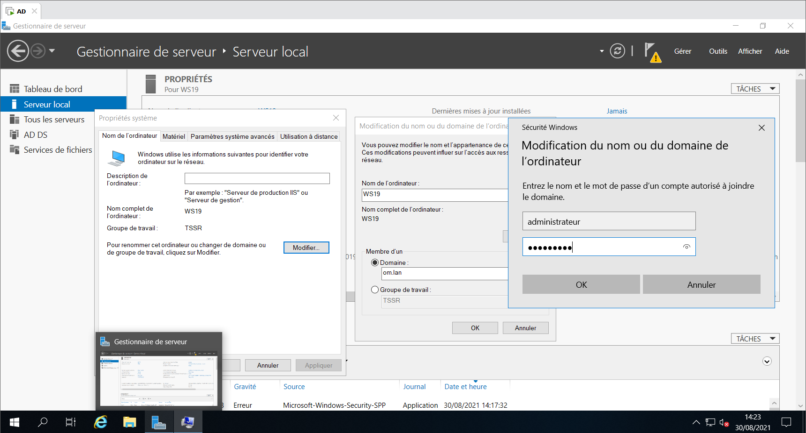
- Enfin se connecter en tant qu'administrateur du serveur (dans notre cas, login: OM\Administrateur)
- Désactiver le pare-feu qui vient se rajouter suite à l'entrée dans le domaine.

*On clique sur le drapeau orange et on lance "promouvoir en contrôleur de domaine" :*

- Ajout contrôleur de domaine au domaine existant
- Verifier qu'on est sur le bon domaine (om.lan)
- Vérifier qu'on est bien sur le site de "Paris" et choisir le bon serveur à répliquer.
- Rentrer le mdp de restauration.
- Verifier que tout est au vert, puis lancer l'installation.  

*Une fois installé, voilà quelques checks et réglages à faire:*

- Carte Réseau: Vérifier les paramêtres de carte. Mettre la nôtre en DNS primaire (192.168.20.51) et en DNS secondaire celle du contrôleur principal (192.168.20.201).
- Vérifier dans l'AD, que tous les domaines controleurs secondaires sont bien présents.  
- DNS: Vérifier qu'on a bien récuperé om.lan, om.fr et la zone reverse. Supprimer les records inutiles.
- Créer un alias ldapjbf qui pointe sur notre serveur secondaire sur om.lan
- Créer un host A ldapjbf qui pointe sur notre serveur secondaire sur om.fr
- Allez dans Domaines et Approbation AD et vérifier qu'on a bien récuperé les suffixes de noms de domaine.  
- Allez dans Sites et services AD Sites/Paris/Servers, on doit tous y être. Si on développe notre serveur, on doit avoir notre *NTDS Settings* et enfin à droite on retrouve nos partenaires de réplications.  

Utilisateurs et ordinateurs AD :

- Builtin : on s'en sert assez peu au quotidien
- Computer : OU d'arrivée des PC et des serveurs dans l'AD
- Domain Controller : AD secondaire
- Users : Compte admin + autres comptes par défaut (structures d'OU/sous-OU)
  - Administrateur du domaine = niveau le plus bas (accès domaine pour l'usage quotidien)
  - Administrateur du schéma = possibilité de modifier le schéma (op d'expertise et de migration)
  - Administrateur de l'entreprise = total accès à toute la structure de l'AD

### Comment se structure un AD

Une arborescence AD, ses OU et ses sous-OU, dépendent de l'entreprise dans laquelle on se trouve.

**Un exemple d'organisation (les bonnes pratiques) :**

- Côté machine:
  - Création OU Serveurs (donc tout serveur qui arrive dans computers doit être déplacé dans cette OU)
  - Création OU Machines
    - Création sous-OU: Fixes
    - Création sous-OU: Portables
  - Création OU SallesInformatiques (y mettre les pcs de cette salle)
- Création OU BALS Générique pour ne pas mélanger les boites aux lettres avec les comptes génériques.
  
On peut décliner par types de machines, au niveau des utilisateurs.  
Exemple:  
| OU global | COMPTESOFFICE365 | GOUPES
|:-:|:-:|:-:|
|sous-OU| Administratifs | Sécutité (on peut créer 2 sous OU ex: Appli / Data) |
|sous-OU| Enseignants | Liste de Diffusion |
|sous-OU| Vacataires |
|sous-OU| Exterieurs |

*Ne pas mettre d'espace ou de caractères spéciaux dans les noms d'OU*

### ON VA MANIPULER

Créer une OU principale par personne pour éviter les conflits (Delegue).

|Créer des sous-OU:| |
|:-:|:-:|
| ComptesUtilisateurs / Groupes / Dans la sous-OU Groupes, créer deux sous-OU / Securite /ListesDiffusions|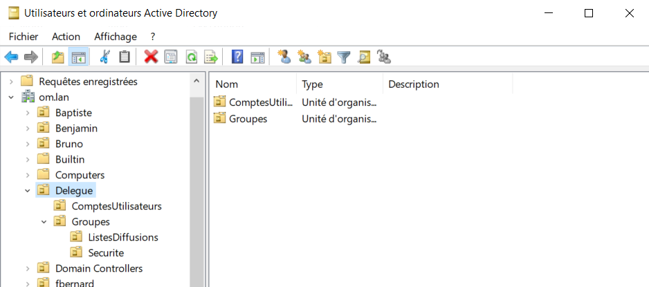|

|Créer nos trois premiers utilisateurs.| |
|:-:|:-:|
| Mettre le nom en majuscule et le mettre avant le prénom | 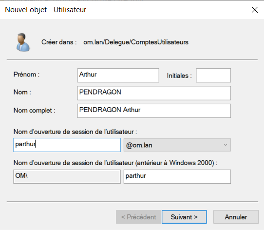|

Clique-droit Propriétés sur l'user :
  - Mettre le plus de renseignements possibles pour avoir quelque chose de complet, fortement apprécié des users.

| Créer un groupe de sécurité | |
|:-:|:-:|
| Créer un groupe DSI et un groupe ServiceIT. Mettre ServiceIT dépendant du groupe DSI | 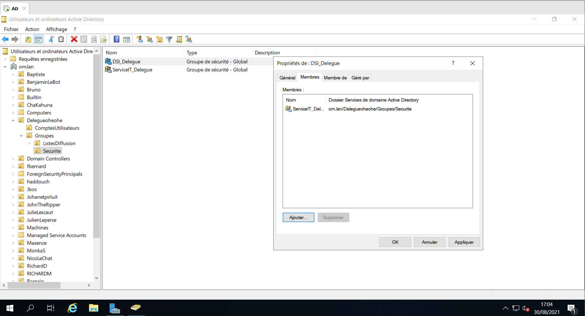|
| Ajouter l'utilisateur dans le groupe ServiceIT | 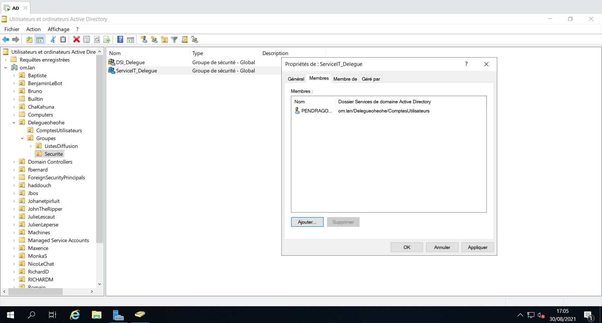

*AzureAD va aspirer le compte d'Arthur PENDRAGON et le synchroniser avant sa boite mail*

## GPO ET TRANSFERTS DE FICHIER

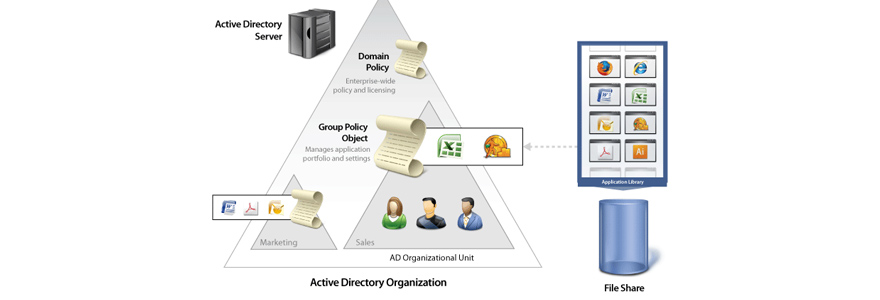

*Tout ce dont on parle n'est valable que si l'entreprise ne peut pas utiliser Teams ou Sharepoint*

**PC Portables ou Fixes**

- Besoins du personnel :
  - Environnement de Bureau
  - Données pures :
    - Personnelles
    - partagées ou communes ou collectives
  - Images / Photos
  - Favoris Internet (Edge)
*Tout doit être sur le réseau ! Rien en dur sur le disque du PC*  

Côté GPO :

- Attention : pour les entreprises passant par TEAMS ou SHAREPOINTS pas besoin de GPO car centralisé via les logiciels
- Attention : les données doivent être mises sur des serveurs de fichiers donc sur le reseau via GPO
    - GPO = du bureau (va prendre le bureau local et le transposer sur le serveur de fichiers/réseau etc.)
    - Nécessite gros serveurs de fichiers (baie de stockage) = disques VM pointés vers baie de stockage 
    - VM branchées sur baies en ESX (derrière le cluster ESX il n'y a que des baies de stockage) = baie connectée aux ESX
        - Avenir = hyperconvergence (on s'affranchit des baies) = VMWare sait embarquer le stockage dans son noyau, stockage embarqué dans les clusters VSAN qui deviennent aussi baie (baie de stockage imbriquée à VMWare, disques en full flash)
- Attention : les GPO ne proposent pas la redirection des ressources partagées
    - (1) nécessite script powershell pour reconnecter le lecteur réseau (script de connexion dans une GPO)
    - (2) vous connectez sur le compte de l'user directement le lecteur reseau des partages collectifs avec l'onglet ...

**Côté serveur de fichiers**

Grosse bête pointe vers une baie de stockage. Elle projète des volumes directement sur le serveur. Et le serveur dans l'explorateur Windows va présenter la baie.

Sur le serveur de fichier: Arborescence dossiers  
D: Dossiers Ultisateurs --> partagé --> Sécurité NTFS

  - Dossier individuel des utilisateurs --> Pas de partage --> Sécurité NTFS
  - Le dossier pour qu'il redescende en GPO doit s'appeler avec le SAM (S. Acompte Mail.) --> %UserName%
  - Partages --> partagé --> Sécurité NTFS

**Première GPO**

Toujours faire ses GPO sur la dernière sous-OU.  
Outilis / Gestion des stratégies de Groupes.  

|Creer une GPO|
|:-:|
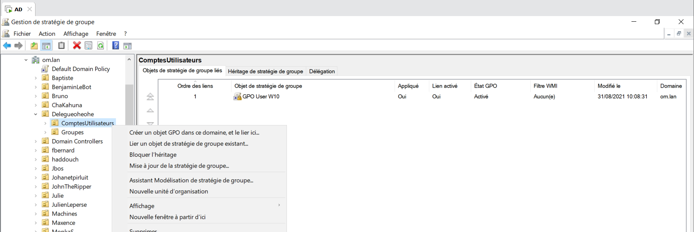

Clique-droit / Propriétés sur la GPO qui vient d'être créée.

|Script Powershell| |
|:-:|:-:|
| Mettre le script dans le dossier (en bas l'image), puis le charger dans le gestionnaire. |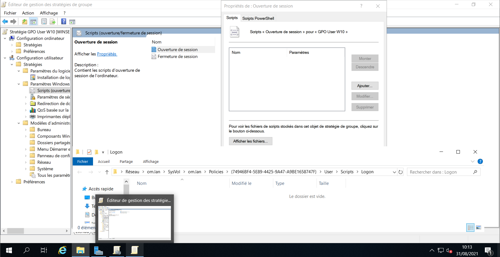|

Création de notre arborescence de fichier sur le lecteur C:

- > C:\Partages\DSI\Service_IT

### Sur le dossier parent DossiersUtilisateurs

Clique-droit sur le dossier Partages/Propriétés bouton "Partage avancé" pui cocher "Partager ce dossier". Puis bouton "Autorisations" et Autoriser le contrôle total. Les vrais droits sont gérés par l'onglet "Sécurité".
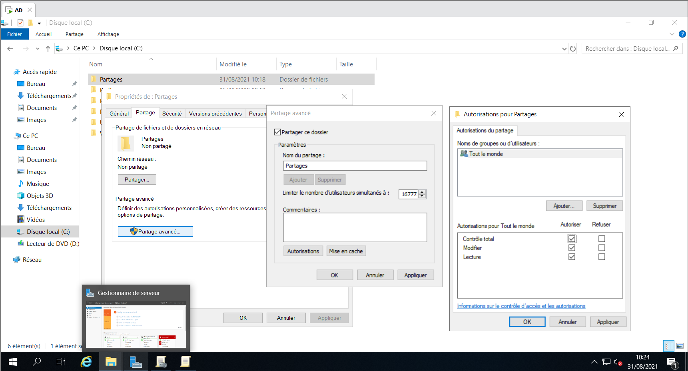
*Ne pas oublier l'autorisation partage sinon pas de partage*
  
Dans l'onglet "Sécurité", donc, cliquez le bouton "Avancé" puis le bouton "Désactiver l'héritage" et choisissez "Convertir [...] sur cet objet" puis "Appliquer" et OK. Cliquez ensuite le bouton "Modifier" un peu plus haut et là définissez les autorisations finement.

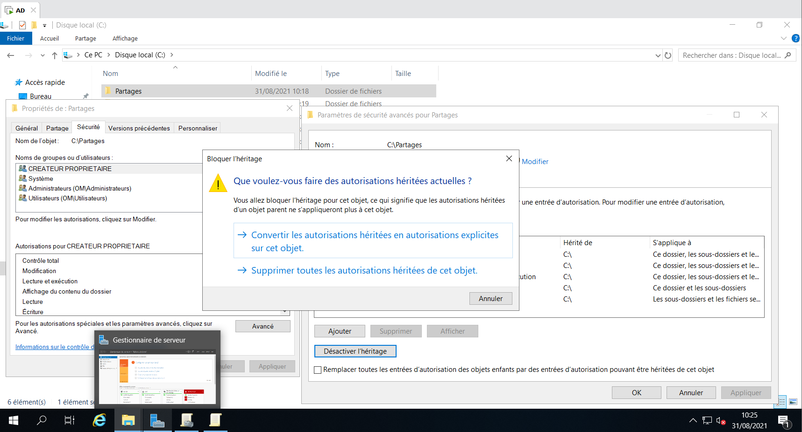
**À mettre partout pour éviter les problèmese :**

- Système: Accès machine, **INDISPENSABLE**
- Admins du domaine (OM\Admins du domaine) : On fait ajouter, rechercher puis on trouve "admins du domaine" dans la liste (tous les utilisateurs et groupes sont listés ici).
- Utilisateurs Authentifiés (suivant le cas, peut être remplacé par un groupe ou un utilisateur spécifique).

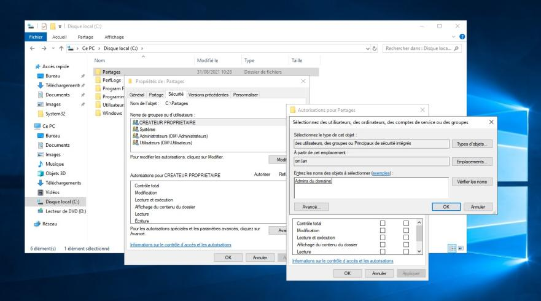

- Ajouter/Avancé/Recherche/Utilisateurs authentifiés/OK

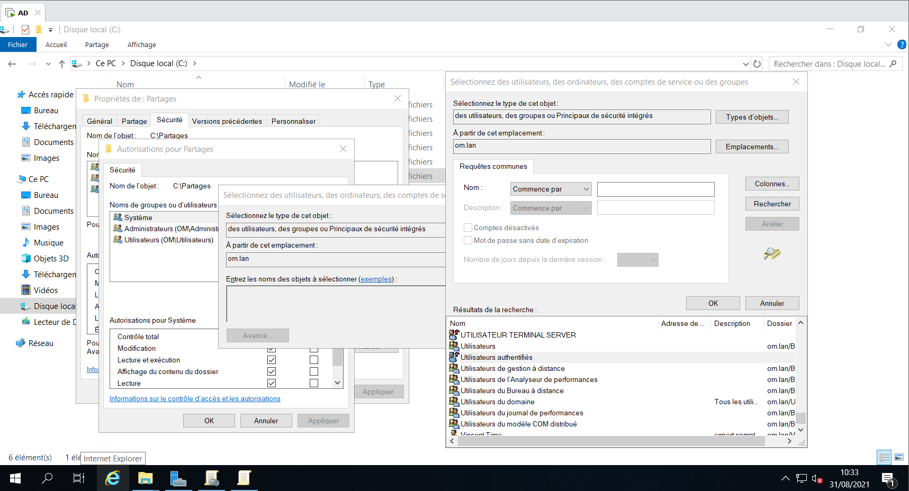

### Sur le dossier enfant DSI

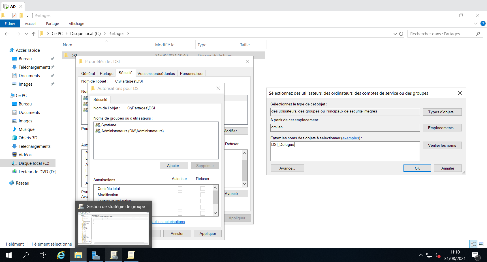

**Ne pas laisser le *CONTROLE TOTAL* pour les utilisateurs car cela leur donne accès à l'onglet de sécurité, ce qui est une faille de sécurité énorme.**

### Faire la même procédure pour le dossier enfant Service_IT

On vas s'occuper de l'arborescence des dossiers utisateurs :

- On crée le dossier à la racine du disque :
  - > C:\DossiersUtilisateurs
- On applique le partage sur ce dossier (comme vu précedemment).
- Sécurité :
  - On désactive l'héritage (comme vu précédemment).
  - On active la sécurité système, administrateur du domaine et utilisateurs authentifiés.
- Dans le dossier parent, on crée un dossier enfant avec le SAM de l'utilisateur (apendragon).  
  - On gère la sécurité (comme vu précedemment) mais on enlève l'utilisateur authentifié que l'on remplace par l'user, avec les rêgles adéquates (tout sauf *contrôle total*)

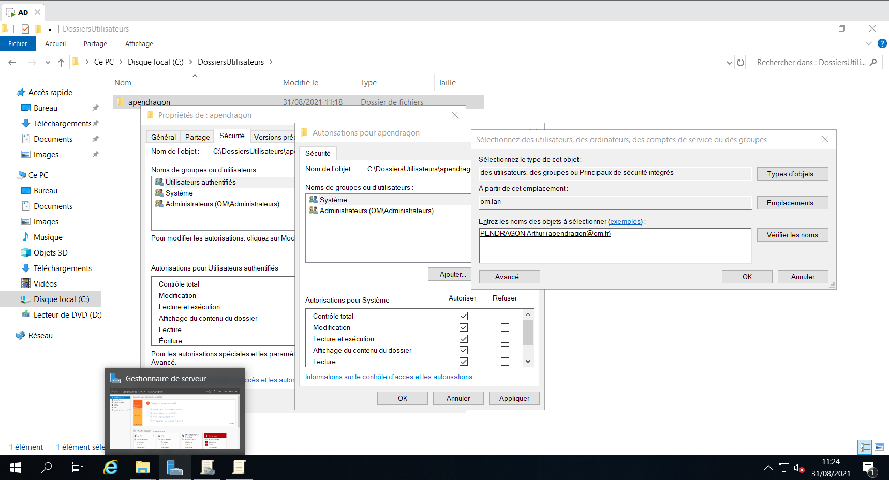

### Quotas

Sur C: Clique-droit/propriétés/onglet "Quota" :

- Afficher les paramètres de quota
- Cocher Activer la gestion
- Refuser de l'espace disque ...

Si on ne rend pas l'utilisateur propriétaire de son dossier, il n'aura pas son quota.
Pour faire de l'individuel, il faut cliquer-droit sur l'user pour gérer son espace disque.

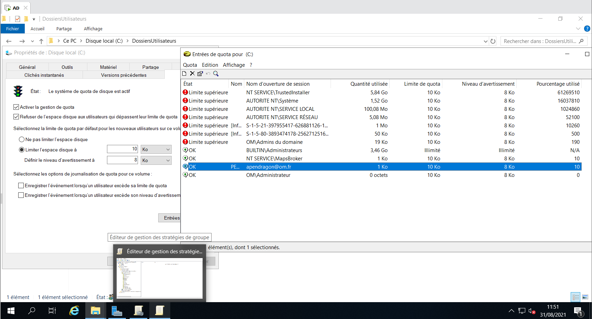

Clique-droit sur le dossier /Propriétés/Sécurité/Avancé/Modifier et choisir l'utilisateur.  
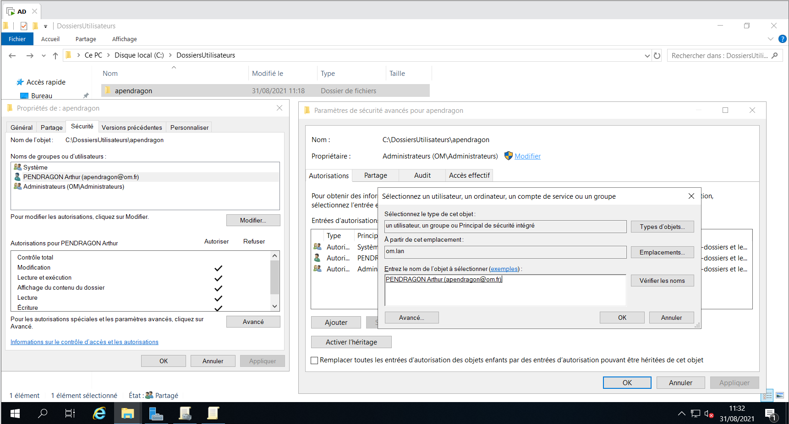

### Dossiers des utilisateurs

Ouvrir l'éditeur de Gestion des stratégies de groupes 
Bureau :

- Clique-droit/propriétés/Cible  
  - Paramêtres: *De base*
  - Rentrer le chemain d'accès à la racine \\\WS19\DossiersUtilisateurs

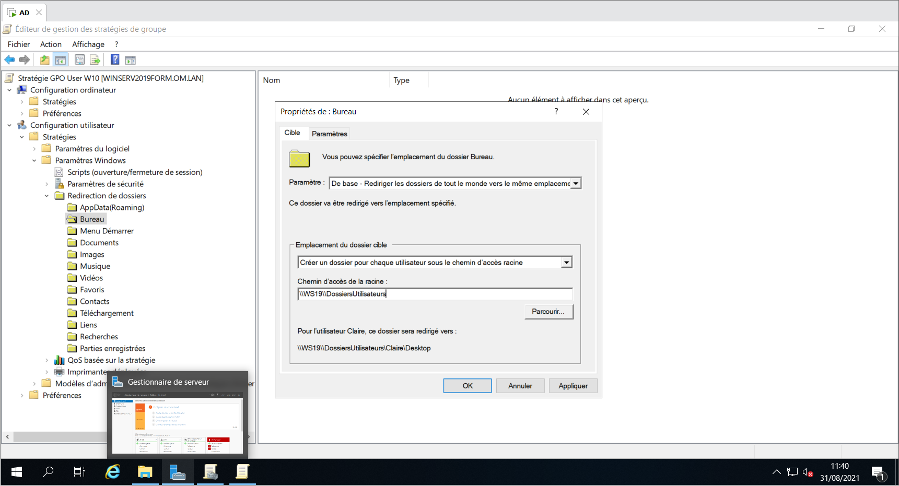

- Clique-droit/propriétés/Paramètres
  - Décocher *Accorder à l'utilisateus des droits exclusifs sur Bureau* (sinon les admins ne peuvent plus y accèder pour régler des problèmes)  


Favoris :
- Clique-droit /propriétés/Cible
  - Paramêtres: *De base*
  - Rentrer le chemain d'accès à la racine \\WS19\DossiersUtilisateurs

Documents :

- Clique-droit /propriétés/Cible
  - Paramêtres: *De base*
  - Rentrer le chemin d'accès à la racine \\WS19\DossiersUtilisateurs

Images :
- Clique-droit /propriétés/Cible
  - Paramêtres: *Suivre les documents*  

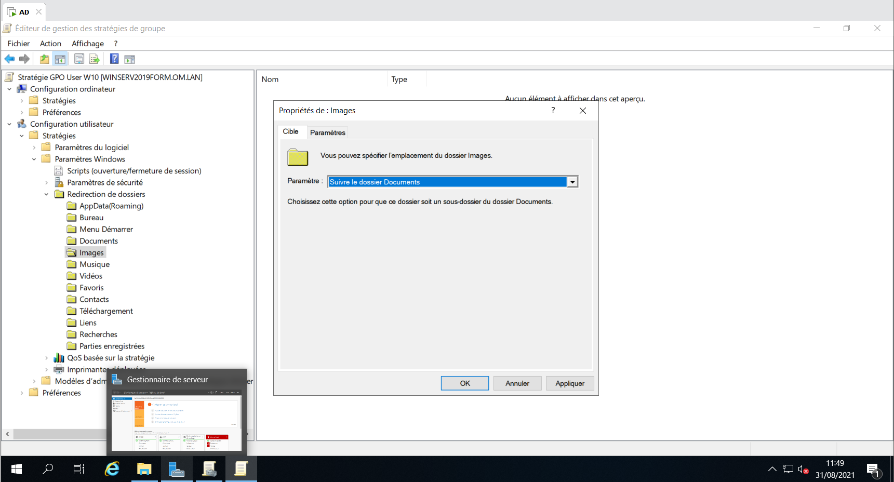

Pour le partage colléctif :

- AD
- User / Compte Utilisateurs / Delegue / ComptesUtilisateurs
- clique-droit / Propriété / Profil / chemin d'accès local
    - Z:\\\WS19\Partages\DSI

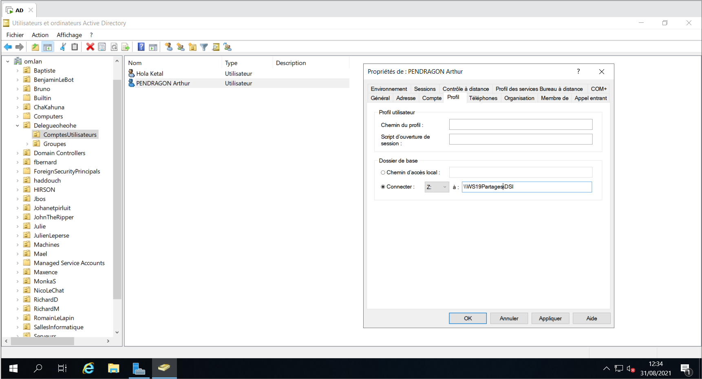

Vérification du bon fonctionnement des GPO :

- Monter un W10
- Créer un user à rattacher au domaine (check dans computer dans l'AD pour l'arrivée)
- Mettre un fichier dans un des dossiers Documents/Images/...
- Check dans l'AD s'il apparait bien dans l'arborescence de l'AD par DossierUser

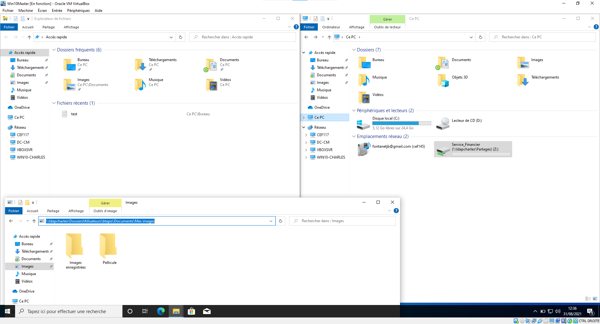

**Ressources :**

- [Entretien AD](https://www.active-directory.info/comment-bien-entretenir-son-annuaire-active-directory%E2%80%89/)

---

## MIGRATION ACTIVE DIRECTORY 2016 vers 2019 (lvl ingénieur)

***Migration de version d'AD / Passer de 2016 à 2019***

**Ressources web :**

- [Docs microsoft : Installer, mettre à niveau ou migrer vers Windows Serveur](https://docs.microsoft.com/fr-fr/windows-server/get-started/install-upgrade-migrate)
- [System-net : Migration Windows Server 2019 : Les étapes](https://www.system-net.fr/windows-server-2019/)
- [How to: Migration to Windows Server 2019 / 2016, including applications, profiles, shares and data](https://www.zinstall.com/how-to/how-to-server-2016-migration-software-for-windows-server-2003-2008-2012)
- [Migration d’une infra simple d’un serveur Active Directory 2012R2 vers 2016](https://laboiteajb.fr/migration-dune-infra-simple-dun-serveur-active-directory-2012r2-vers-2016/)

### Elements de compréhension et étapes à suivre

*Attention : Nécessite de monter de niveau fonctionnel 2012 vers 2016 (niveau fonctionnel toujours au plus haut pour migration)*

#### Migration simple


**Existant**

| DC Principal | DC secondaire |
|:-:|:-:|
|Rôle FSMO| - |
|AD WServer 2016| AD WServer 2016|

**Préparation à la migration**

Faire venir une forêt 2019 dans une forêt 2016 = trois étapes exclusives au prinicpal (puisque possède les FSMO) pour préparation :

  1. couper les réplications AD entre contrôleurs (1 ligne de commande à passer) 
  2. préparer la forêt (1 ligne de commande à passer)
  3. préparer le domaine (1 ligne de commande à passer)

**Première étape de migration**

- Préparation d'un WServer 2019 : NIC, antivirus etc.
- Insérer le WServer 2019 en contrôleur de domaine secondaire dans la forêt 2016
  - Va se coller à la forêt 2016
  - Mode dit "mixte" (possible de rester ainsi plusieus mois)

| DC Principal | DC secondaire | DC secondaire
|:-:|:-:|:-:|
|Rôle FSMO| - | - |
|AD WServer 2016| AD WServer 2016| AD WServer 2019|

**Seconde étape de migration**

- On migre les FSMO (les 5) doivent migrer vers DC secondaire 2019 
    - Via interface graphique

| DC secondaire | DC secondaire | DC principal
|:-:|:-:|:-:|
| - | - | Rôle FSMO |
|AD WServer 2016| AD WServer 2016| AD WServer 2019|

**Troisième étape de migration**

- Rétrogradation du second contrôleur secondaire
    - Plus DNS ni AD
    - Redevient serveur simple

| DC secondaire | Serveur simple | DC principal
|:-:|:-:|:-:|
| - | - | Rôle FSMO |
|AD WServer 2016| AD WServer 2016| AD WServer 2019|

**Quatrième étape de migration**

- On crash/réinstalle le serveur simple en WServer2019
- On le fait venir en secondaire en 2019

| DC secondaire | DC secondaire | DC principal
|:-:|:-:|:-:|
| - | - | Rôle FSMO |
|AD WServer 2016| AD WServer 2019| AD WServer 2019|

- Bis repetita pour le premier contrôleur

| DC secondaire | DC secondaire | DC principal
|:-:|:-:|:-:|
| - | - | Rôle FSMO |
|AD WServer 2019| AD WServer 2019| AD WServer 2019|

---

## Migration de forêts

- Entreprise : acab.lan
- Achat ou fusion : nouveau nom, nécessite une nouvelle forêt (ex. anar.lan)
- Annunaire unique, identifiant unique à partir de plusieurs annuaires/identifiants

| Forêt 1 | Forêt 2 | > | Nouvelle forêt 1 | Nouvele forêt 2 |
|:-:|:-:|:-:|:-:|:-:|
| acab.lan | acab.lan | > | anar.lan | anar.lan |
| Controller 1 | Controller 2 | > | NvController 1 | NvController 2 |

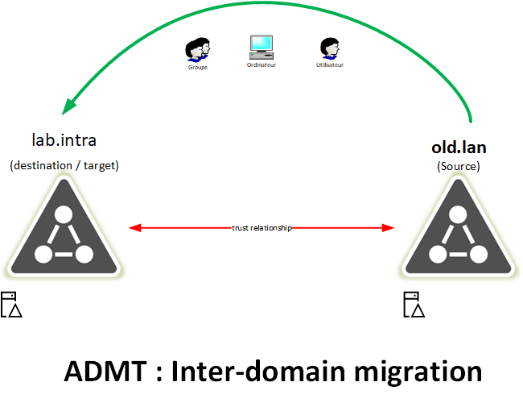

- Temps long :
    - Mise en place DNS (Zone de stub, redirecteurs conditionnels) + relations d'approbation bi-directionnelle entre les deux domaines/forêts = permet la communication entre les deux forêts
    - Utilisation d'un [server ADMT](https://rdr-it.com/admt-outil-de-migration-de-domaine-active-directory/3/) pour la migration les objets de la source vers la cible
    - Installation de [Password Export Server](http://pbarth.fr/node/112) : utilitaire de migration des mots de passe
    - Une fois cela effectué on peut commencer à migrer
- On ne supprime les deux contrôleurs de base qu'une fois l'ensemble de la migration effectuée

#### Migration via Azure AD

- Azure AD se base sur l'AD local
- Azure récupère et transpose directement dans Office365


| DC Principal | DC secondaire | <- AZURE AD Source -> | Office 365 |
|:-:|:-:|:-:|:-:|
|Rôle FSMO| - | - | - |
|AD WServer 2016| AD WServer 2016| - | - |
|local 2019| local 2019 | - | - |

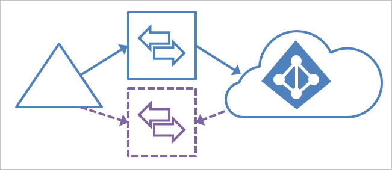

- UPN : obligé de passer par ligne de commande

### ON VA MANIPULER - MIGRATION WINDOWS SERVEUR 2016 A WINDOWS SERVEUR 2019

Sur Windows Serveur 2016  
Ouvrir l'invite de commande dans la VM et se rendre à la racine de C.  

On coupe les réplications :

```cmd
repadmin /options WS16 +disable_outbound_repl
```

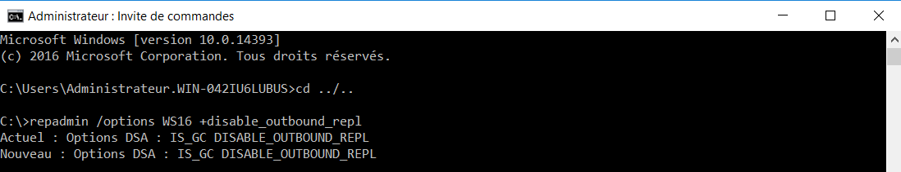

Pour préparer l'AD 2016 à recevoir la fôret de 2019. 
On charge l'ISO de Windows Serveur 2019 dans le lecteur virtuel.  
On se met dans le répertoire support puis adprep.  
> D:\support\aprep>

On tape la commande :

```cmd
adprep /forestprep
```

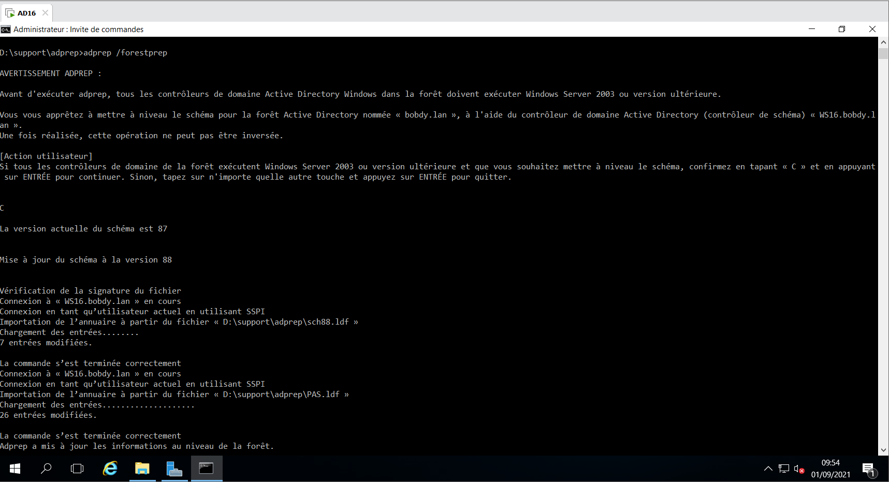
  
Toujours dans D:\support\adprep> , on met à jour le domaine :

```cmd
adprep /domainprep
```

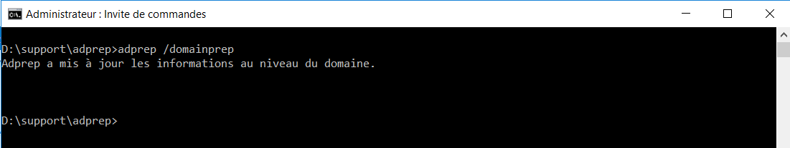

**Ajouter un contrôleur AD 2019 dans notre AD 2016**

Maintenant, on peut ajouter un contrôleur AD 2019 dans notre AD 2016.  
On réactive les répliques et on n'y touche plus. Pas besoin de les couper à nouveau, même si on reprend la migration des mois plus tard.  
Retour dans C:

```cmd
repadmin /options WS16 -
```

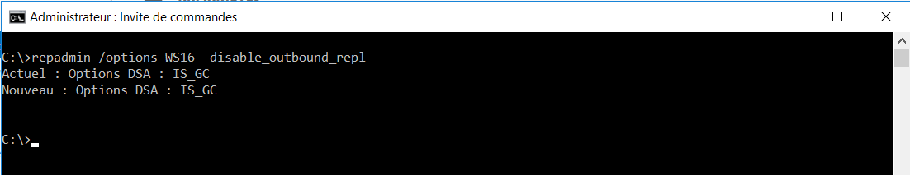

On monte un Windows Serveur 2019.  
On désactive le firewall et on met l'adresse du contrôleur de domaine 2016 en DNS primaire.  
On prend une petite sécurité, on ping les machines entre elles.  

Ensuite, il faut ajouter le Windows Serveur 2019 dans le **domaine** bobdy.lan  

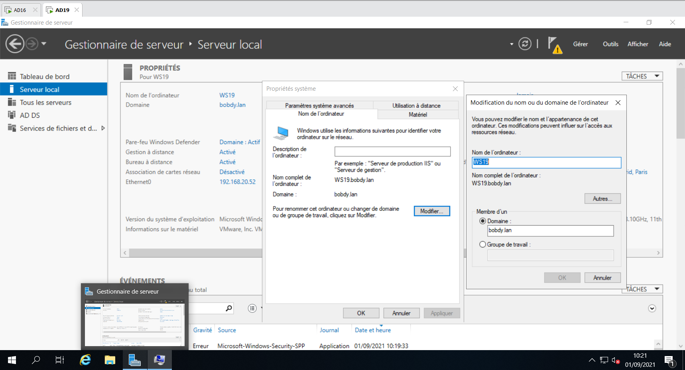

**Se reconnecter dans le Windows Serveur 2019 en compte bobdy\administrateur.**

Installer les rôle AD DS.

Promouvoir en Controlleur de Domaine.  
Verifier qu'on soit bien dans le bon domaine.

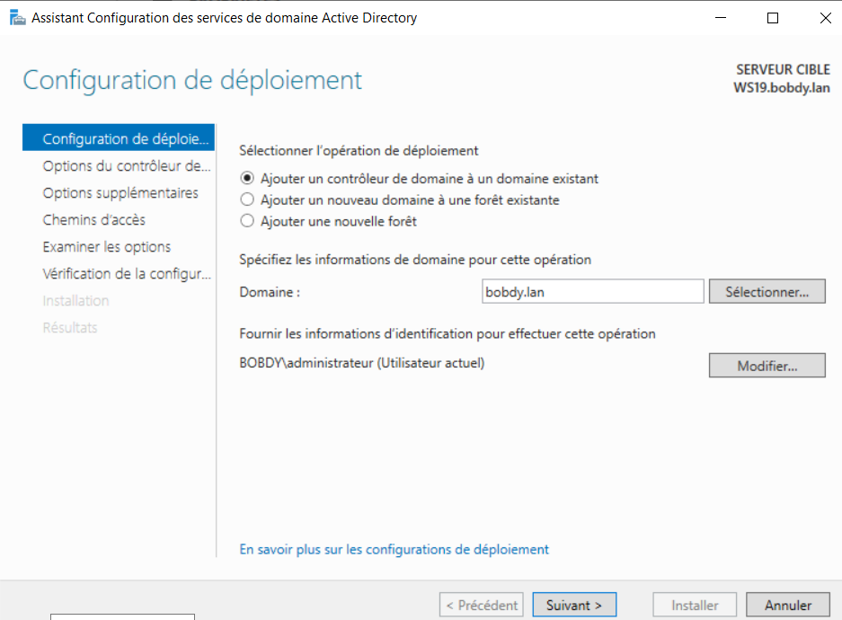

On passe aux vérifications, pour être sûr que tout se soit bien passé :

- Dans l'AD19, Carte Réseau : mettre l'AD 2019 en DNS primaire et l'AD 2016 en DNS Secondaire.
- Dans l'AD19, Gestionnaire DNS: Verifier qu'il y ait bien :  
    - les zones, les records et les zones inversées.  
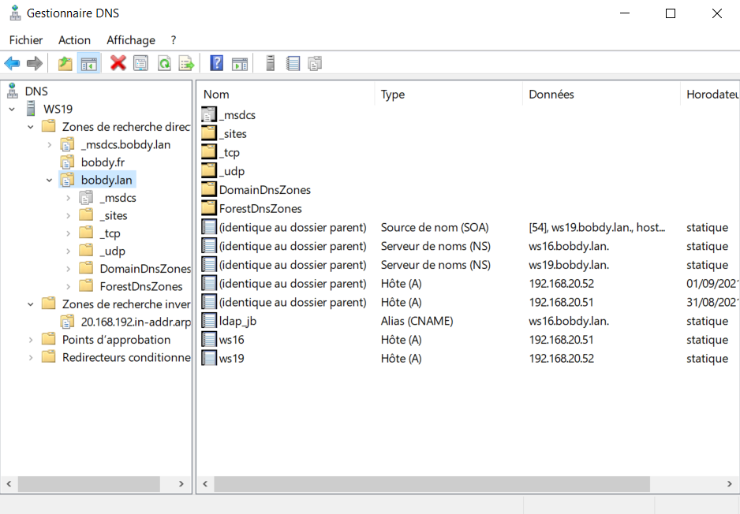
    - les serveurs de noms
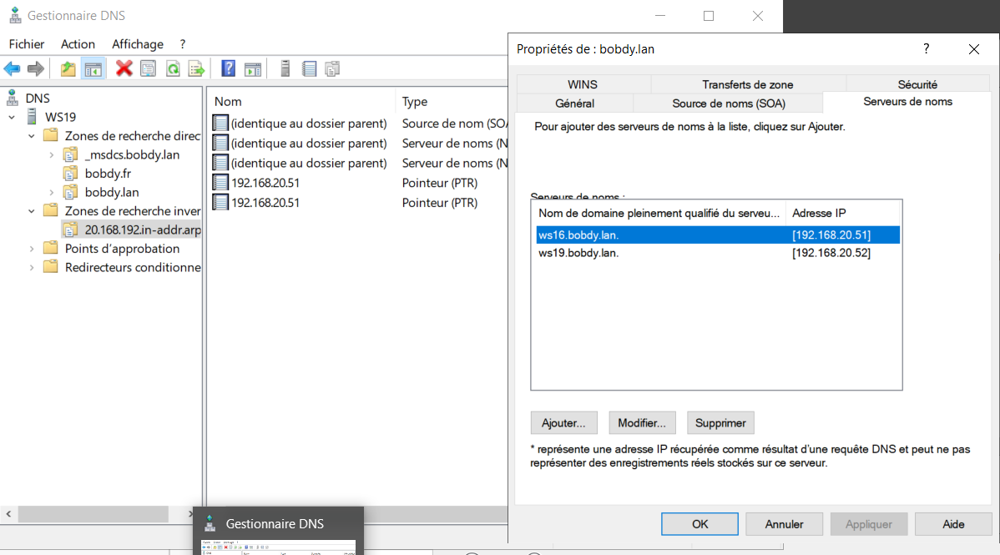
    - les suffixes UPN  
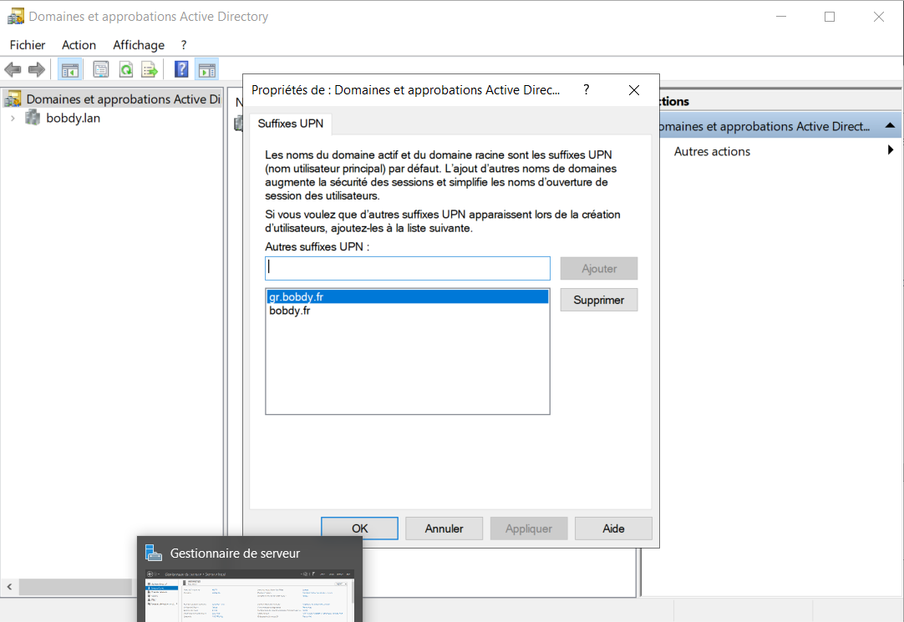
    - les sites et services  
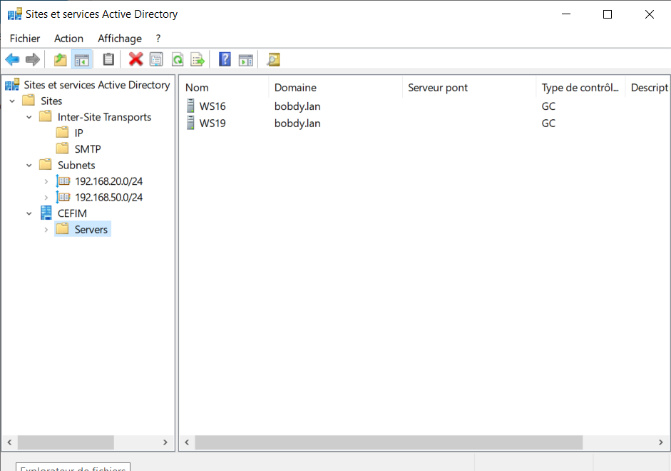
  - les réplications  
  - les OU et sous-OU
  - Dans l'AD 2016, dans les paramêtres de carte réseau, mettre comme DNS secondaire l'AD 2019.

**MIGRATION DES ROLES FSMO DE l'AD2016 à L'AD2019**

Le premier rôle à migrer est caché. Il faut donc le faire apparaitre via une *petite commande*. Ouvrir l'invite de commande et se renre à la racine C:\

```cmd
regsvr32 schmmgmt.dll
```

On vas lancer une console vierge :
|windows + R et **mmc**|
|:-:|
|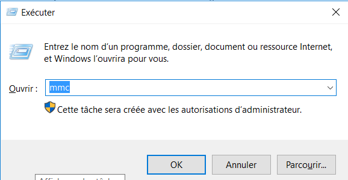|

|Faire "Ajouter[...]enfichables" puis ajouter le Schéma Active Directory|
|:-:|
|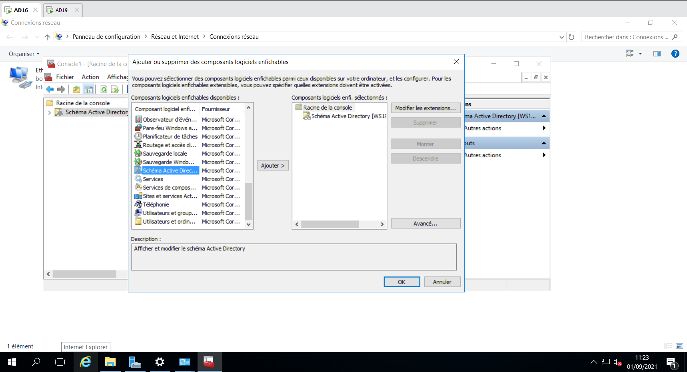|

|Clique-droit sur "Schéma Active Directory", Changer de contrôleur de domaine Active Directory|
|:-:|
|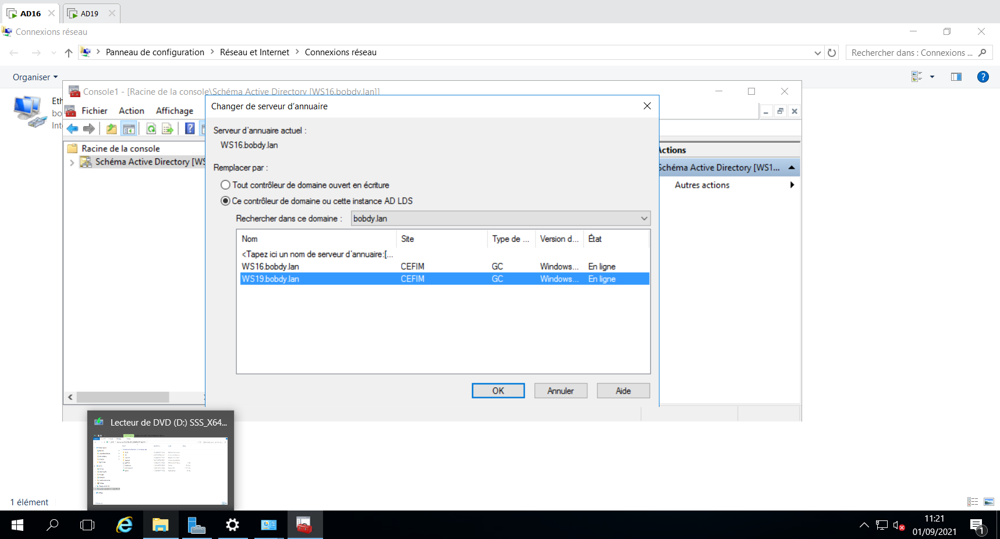|

|Clique-droit sur "Schéma Active Directory", Maitre d'Opérations| Cliquez sur Modifier|
|:-:|:-:|
|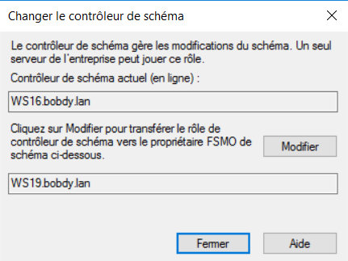|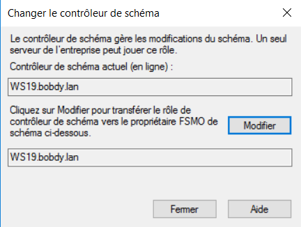

**2ème ROLE**

Dans Domaines et Approbations Active Directory
Clique-droit, Changer de contrôleur de domaine Active Directory et promouvoir l'AD 2019
Clique droit, Maitre d'Opérations, Cliquez sur Modifier

**3 DERNIERS ROLES**

Dans Utilisateurs et ordinateurs Active Directory
Clique-droit, Changer de contrôleur de domaine Active Directory et promouvoir l'AD 2019
Clique-droit sur notre nom de domaine, Maitre d'opérations:

  - RID : Modifier, OUI, OK
  - CDP: Modifier, OUI, Ok
  - Infrastructure: Modifier, OUI, Ok

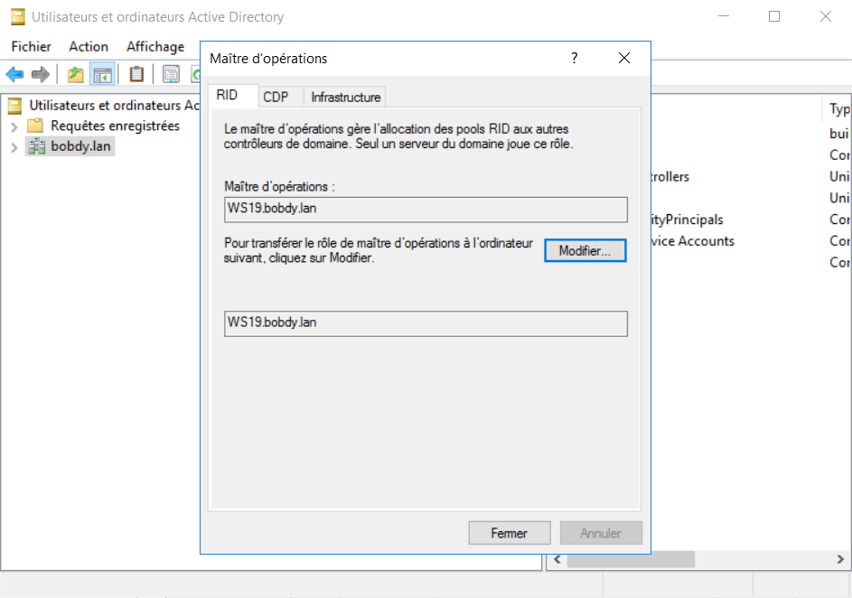

**RETROGRADATION DE WINDOWS SERVEUR 2016**

Gestionnaire de Serveurs, Gérer, Supprimer des rôles et des fonctionnalités.
Il nous propose une méthode de rétrogradation à la décoche.

Décocher Service AD DS  
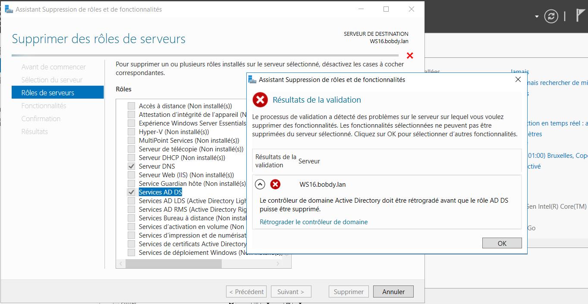

Cocher "Procéder à la suppression"  
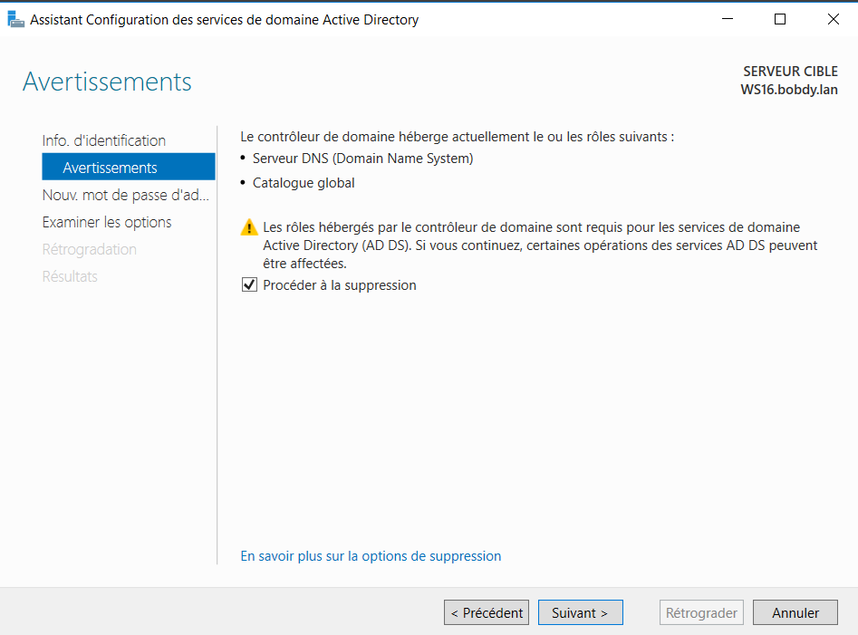

Cliquez sur Retrograder  
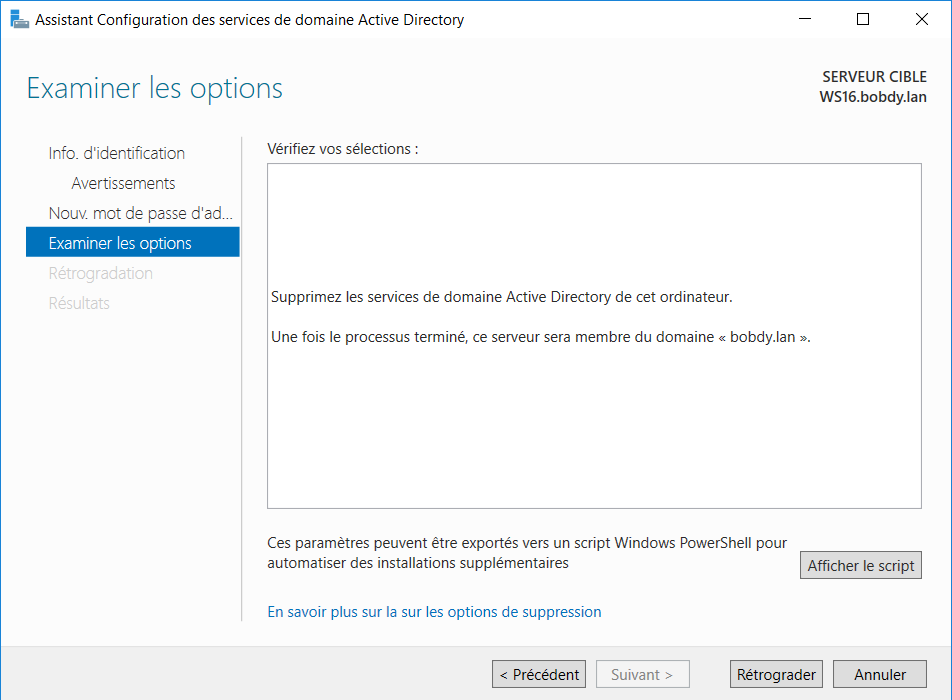

Enfin refaire supprimer les rôles et décocher les deux rôles et cette fois-ci il ne vas pas discuter.  
On va dans les paramêtres de carte réseau et on retire l'adresse IP du DNS du Windows Serveur 2016.  
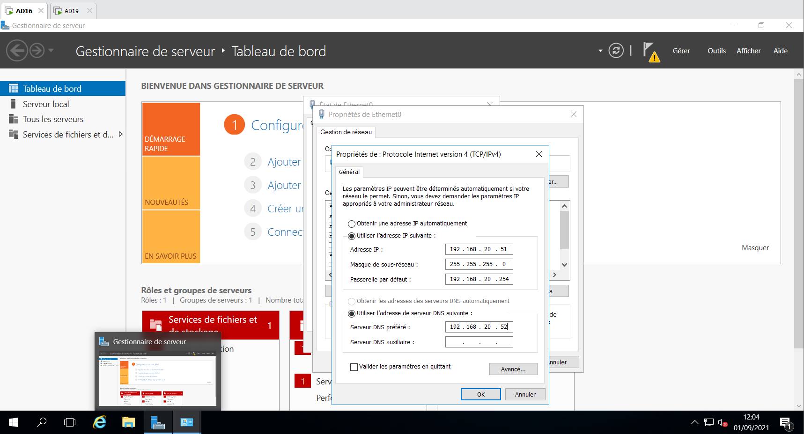

**QUELQUES NETOYAGES SUR LE NOUVEAU CONTROLEUR PRINCIPAL WINDOWS 2019**

Gestionnaire DNS  
Clique-droit sur **bobdy.lan** et vérifier que dans les serveurs de noms, l'ancien serveur 2016 n'y soit plus et sinon supprimez le.  
Idem dans **bobdy.fr**

Sites and Services Active Directory  
Supprimez le serveur WS16.  
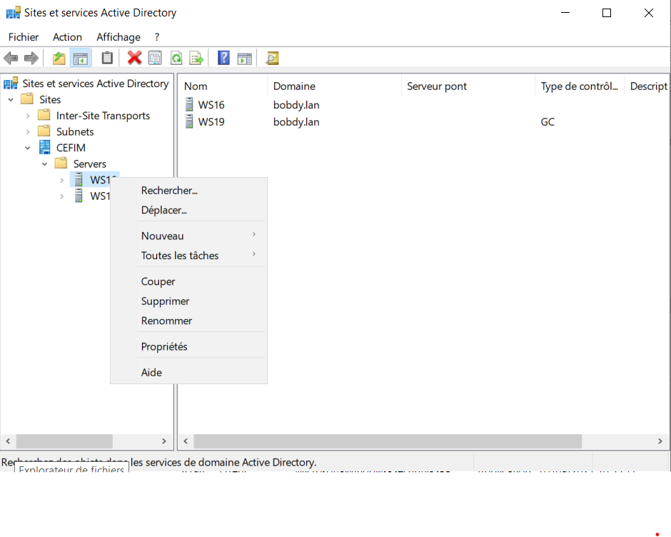

Utilisateur et ordinateurs Active Directory  
Supprimez le serveur des computers.

Gestionnaire DNS
Supprime le record du Windows Serveur 2019  

|***Dernière opération, dans Domaines et approbations Active Directory, clique-droit, augmenter le niveau fonctionnel de la forêt. Sur une migration AD2016 à AD2019, il n'y en a pas besoin. Par contre de AD2008 à AD2012, deAD2012 à AD2012R2 et AD2012R2 à AD2016 il y a un niveau fonctionnel à monter.***|
|:-:|

### ON VA MANIPULER - MIGRATION INTER-FORET

**Pour supprimer une OU :** *Affichage, fonctionnalités avancées, clique-droit sur propriétés l'OU désirée, supprimer, onglet sécurité, décocher la case.*  

**Préparation de la base pour l'AD19 source et cible :**

- Désactiver les firewalls des 2 Windows Serveur.
- Sur la carte réseau du WS19CIBLE, on fixe l'IP: 192.168.20.53  
- Renommer la machine en WS19CIBLE  
- On installe les rôles Services AD DS et rôles DNS  
- Promouvoir en contrôleur de domaine complétement indépendant : **paradise.lan**  
- Faire les réglages de base classiques  
- Mettre la réplication à 15 minutes  
- Créer son subnet dans Sites and Services AD
- Créer son domaine commercial dans les suffixes UPN en .fr
- On prépare les OU en prévision de la prochaine migration.  
- Même si ca ne communique pas encore: Mettre sur les deux cartes réseaux, les deux DNS.

**Contrôleur Source:**

*On va créer une zone de stub*
|||
|:-:|:-:|
|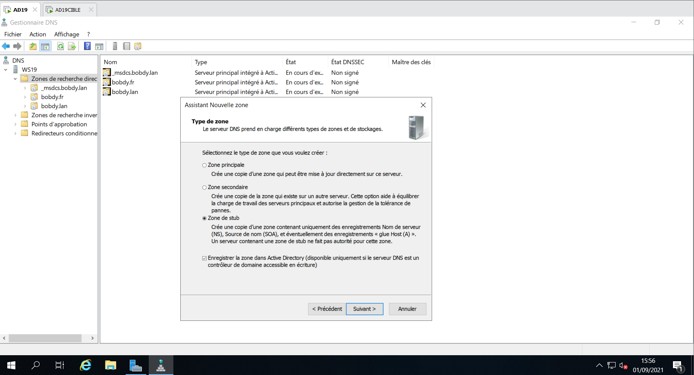|La zone de stub va permettre de joindre la deuxième forêt.|
|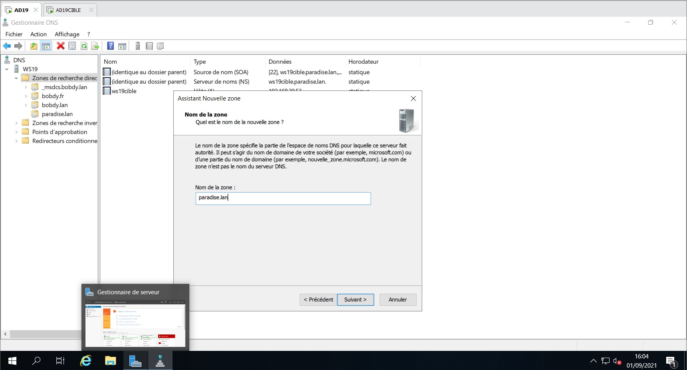|On ajoute notre domaine cible **paradise.lan**|
|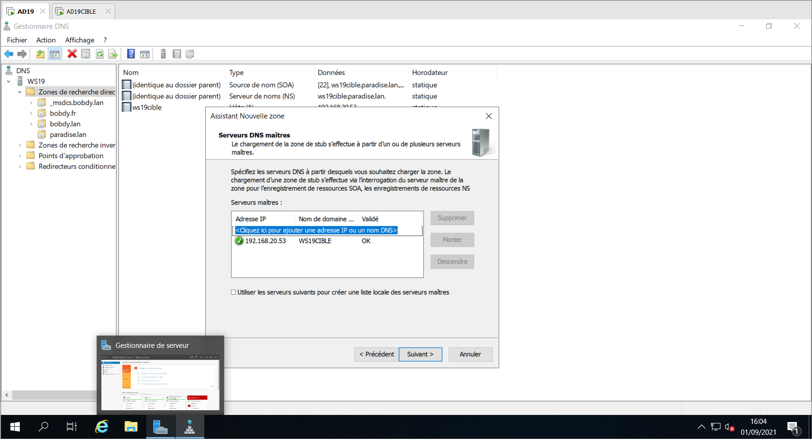|L'adresse IP de notre controlleur cible: 192.168.20.53|

Vérifier que la zone est bien tombée dans les Zones de recherches directes.  

**Contrôleur Cible:**

*Dans le gestionnaire DNS, on va créer un redirecteur conditionnel.*

|||
|:-:|:-:|
|||

**Contrôleur Source:**

On va faire communiquer les deux forêts et les deux domaines.  

Domaines et approbations Active Directory  
Clique-droit sur la propriété, puis Approbations  


Si la zone d'approbation est passée c'est que la zone de stub et le redirecteur conditionnel sont bons.  

On va vérifier côté Contrôleur Cible :

- L'approbation est faite dans l'autre sens.


- Sur le contrôleur cible, changer de domaine pour vérifier que les deux forêts communiquent.

|||
|:-:|:-:|
|||

**GESTION DES DROITS**

|Contrôleur Source|Contrôle Cible|
|:-:|:-:|
|||

On vas permettre une délégation de contrôle sur le domaine cible, pour rajouter le compte administrateur du domaine source aux OU du domaine cible.  

|||
|:-:|:-:|
|||

***Pour afficher l'onglet sécurité, il faut faire affichage, fonctionnalité avancée.***

On rajoute l'Administrateur en contrôle total du groupe sécurité. Idem pour le groupe Staff.  
  

On change de domaine, et on donne les mêmes droits aux administrateurs sur les OU du domaine source.  


**Controleur Source**

Dans l'OU Builtin, il faut créer un groupe avec le nom netbios du domaine source avec 3 fois $ : BOBDY$$$  
Il sert à ADMT(logiciel qui permet la migration) de pouvoir migrer les objets.  
Et il ne faut pas mettre de membre ! (very important)  


Ouvrir la base de registre (créer la clé si elle n'existe pas)

- Clé de registre :

   > [HKEY_LOCAL_MACHINE\SYSTEM\Current\ControlSet\Control\Lsa]
   > "TcpipClientSupport"=dword:00000001  

|||
|:-:|:-:|
|||

**Contrôleur Source et Cible**

Gestion de Stragtégie de groupe.  
Il faut mettre une GPO en place, dans le domaine, Domain Controllers, Default Domain Controllers Policy  
Clique-droit Modifier  
Stratégie
Paramêtre windows  
Paramêtre de sécurtié  
Stratégie Local  
Stratégie d'audit  
Auditer la gestion des comptes.  
Cocher les cases.  


**Ligne de Commande**

Commande pour désactiver le SID filtering.  
 On commence par le contrôleur cible.

```cmd
netdom trust (domaine cible) /domain:(domaine source) /quarantine:no /usero: (compte admin du controleur cible) /passwordo: (password du compte admin du controleur cible)
```

donc

```cmd
netdom trust paradise.lan /domain:bobdy.lan /quarantine:no /usero:administrateur /passwordo:Dadfba16
```


Même commande pour le contrôleur source. (évidemment on adapte la commande.)  

```cmd
netdom trust bobdy.lan /domain:paradise.lan /quarantine:no /usero:administrateur /passwordo:Dadfba16
```  

Commande pour activer le SID History :  
On commence par le contrôleur source.

```cmd
netdom trust (domain source) /domain:(domaine cible) /enablesidhistory:yes /usero:(compte source) /passwordo:(password source)
```  

donc

```cmd
netdom trust bobdy.lan /domain:paradise.lan /enablesidhistory:yes /usero:administrateur /passwordo:Dadfba16
```


Même commande pour le contrôleur cible. (évidemment on adapte la commande.)  

```cmd
netdom trust paradise.lan /domain:bobdy.lan /enablesidhistory:yes /usero:administrateur /passwordo:Dadfba16
```

**ADMT**

Cloner un windows serveur 2016 et l'appeller ADMT  
Désactiver le pare-feu et régler la carte réseau. (192.168.20.54/24 et DNS : contrôleur cible)  
On lui donne le nom ADMT et on le met dans le domaine cible (paradise.lan)  
On redemarre.  
Et on se log en nomdedomaine\administrateur (paradise\administrateur)  

AMDT fonctionnant avec une BDD, il faut lui installer un SQL express.  
[Lien SQL Server Express](https://www.microsoft.com/fr-fr/download/details.aspx?id=55994)  
[Lien ADMT](https://www.microsoft.com/fr-fr/download/details.aspx?id=56570)  
[Lien PES](https://www.microsoft.com/en-us/download/details.aspx?id=1838)

On installe SQL express. (Déclaré en instance et serveur ADMT)  
On installe ADMT (ADMT\ADMT)  
Une fois ADMT installé on peut le lancer.  


On va générer sa clé de chiffrement pour la donner à PASSWORD EXPORT SERVER. C'est pour que PES et ADMT puissent migrer  
Invite de commande :

```cmd
admt key /option:create /sourcedomain:(domainesource) /keyfile:(dans le répertoire que vous voulez)\admt_key /keypassword:(mdp que vous voulez)
```

```cmd
admt key /option:create /sourcedomain:paradise.lan /keyfile:c:\admt_key /keypassword:Dadfba16
```


On install PES sur le contrôleur de domaine source.  
Récupérer le fichier admt_key.pes créé sur le contrôleur ADMT et le mettre dans le contrôleur source pour le charger lors de l'installation.  
Prendre le compte BOBDY\administrateur (domainesource\administrateur) pour se log à PES (dans la bonne pratique, il faudrait créer un compte PES exprès)  

Maintenant, il faut vérifier plusieurs points sur le contrôleur source :

- Clé de registre :

   > [HKEY_LOCAL_MACHINE\SYSTEM\Current\ControlSet\Control\Lsa]
   > "AllowPasswordExport"=dword:00000001  


- Services.msc
  - Il faut vérifier que le service de Password Export Serveur est bien en démarré en automatique et qu'il soit démarré.


**Migration des utilisateurs**

Vérifier que le service, PASSWORD EXPORT SERVICE, soit bien démarré.  
Clique droit, assistant de migrations des comptes d'utilisateurs  


Une fois les utilisateurs migrés, vérifier que les utilisateurs aient bien leurs nouveaux suffixes UPN.  


**Migration des groupes**

C'est identique.  


**Ressources**

[AD](https://activedirectoryfaq.com/2015/10/active-directory-sid-filtering/)  

## AZURE AD CONNECT

Il s'installe sur une VM sur un AD local. Il faut le mettre sur un serveur dédié et il ne fait que ca. Il ne s'occupe que de la synchro.  
On crée un compte AD CONNECT, on le met administrateur général de MS365.

**Commande POWERSHELL**

Pour forcer la synchro :  

```powershell
Start-ADSyncSyncCycle -PolicyType Delta
```

Pour forcer le changement d'UPN :  

```powershell
set-MsolUserPrincipal -UserPrincipalName ancienUPN -NewUserPrincipalName nouveauUPN
```

```powershell
set-MsolUserPrincipal -UserPrincipalName k.novoselic@cefim.eu -NewUserPrincipalName s.julie@cefim.eu
```
