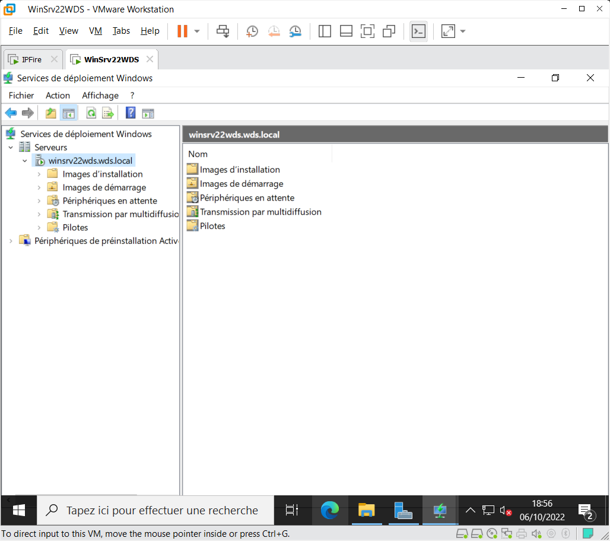
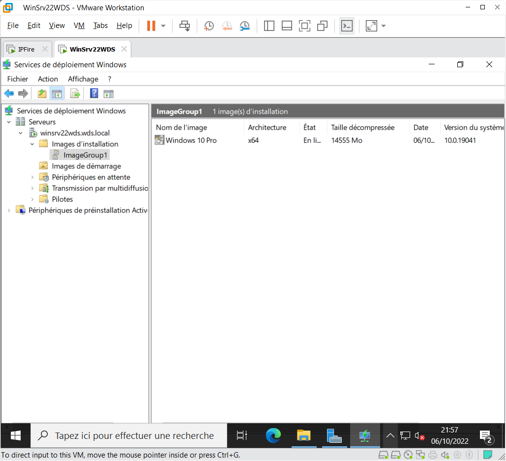
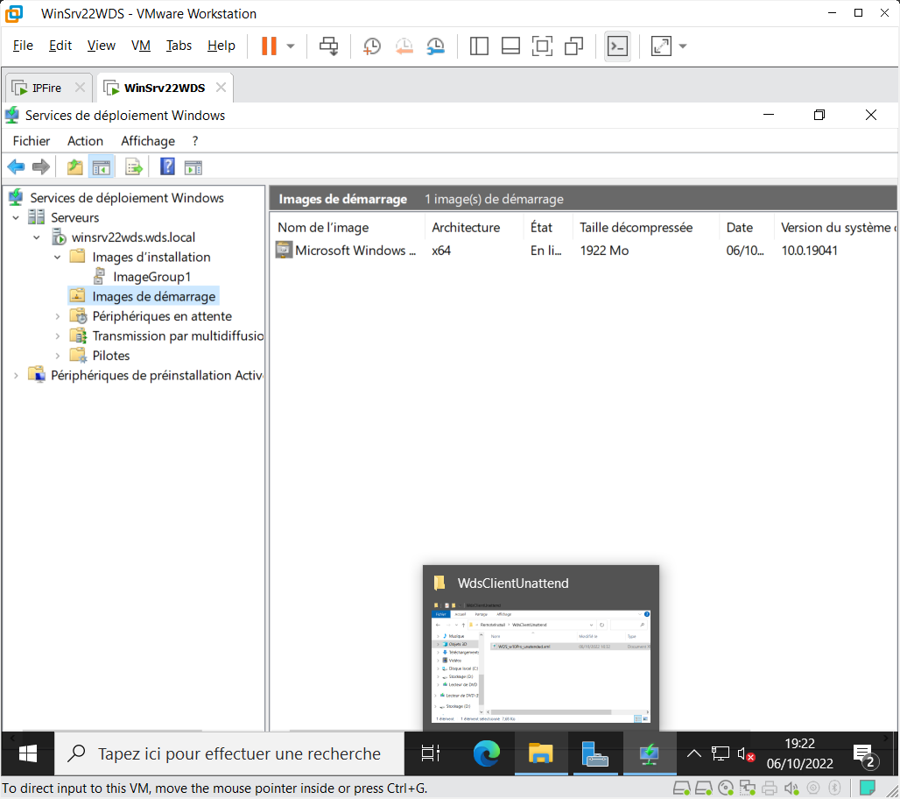
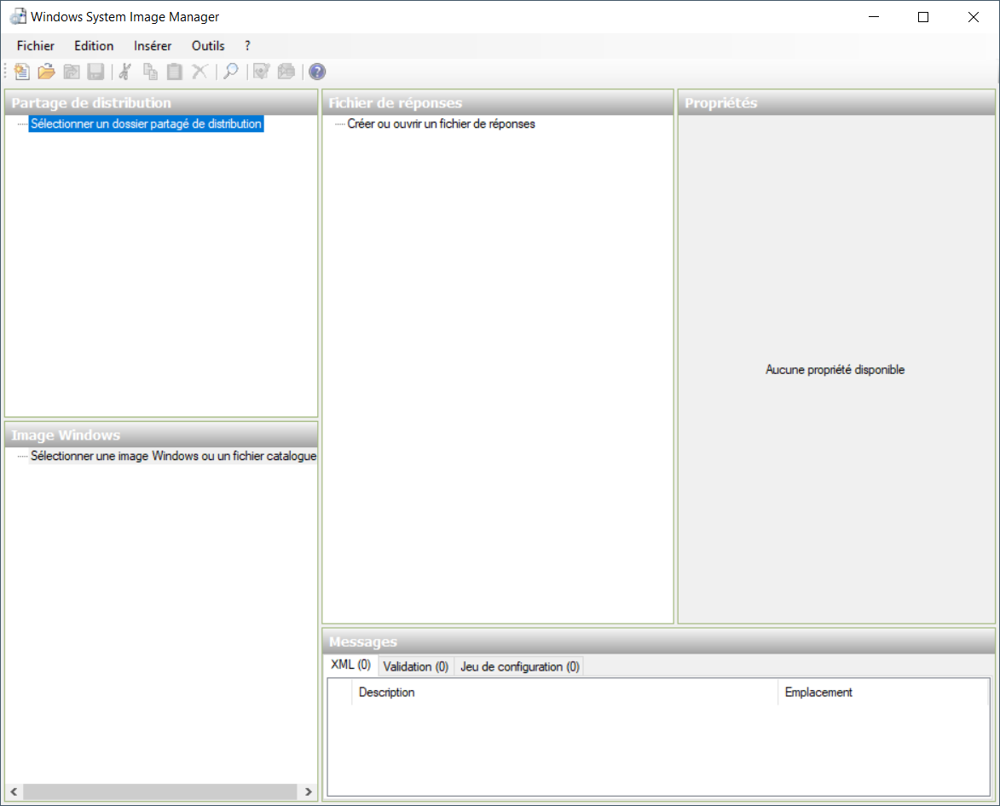
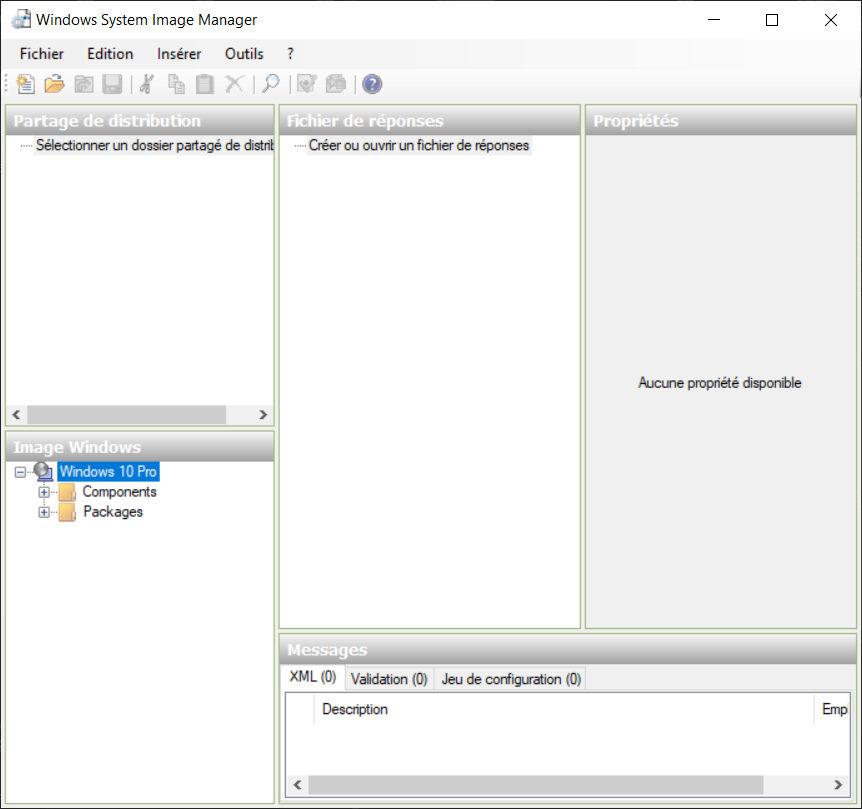
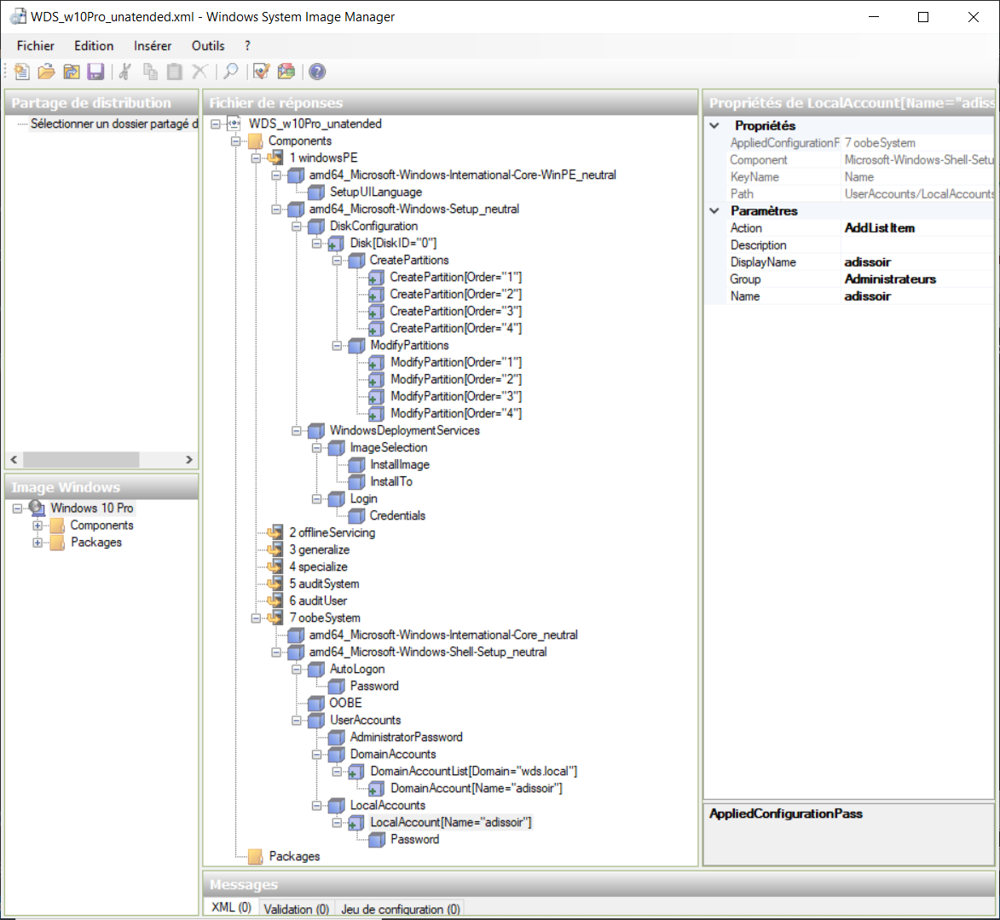
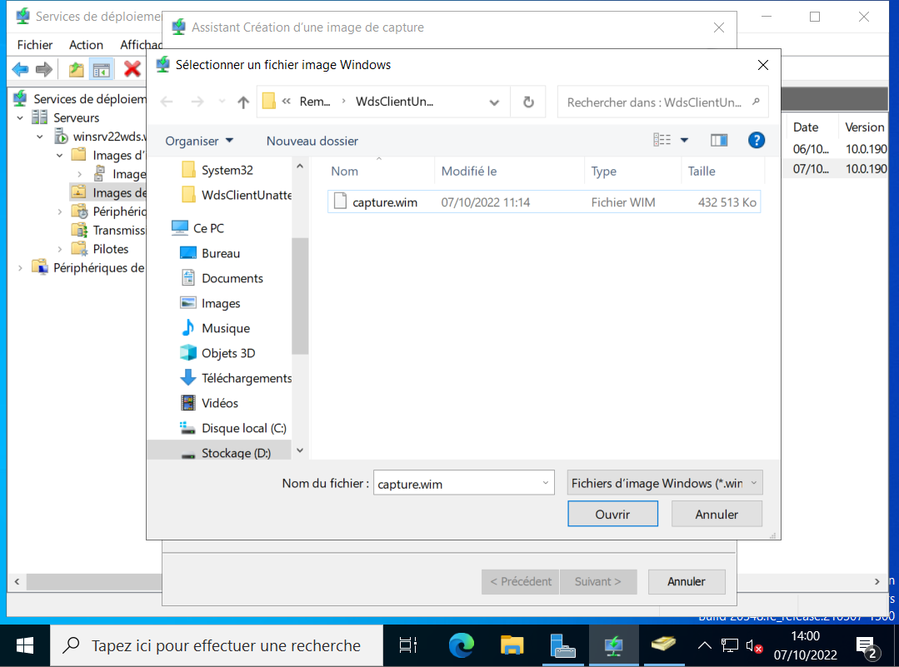
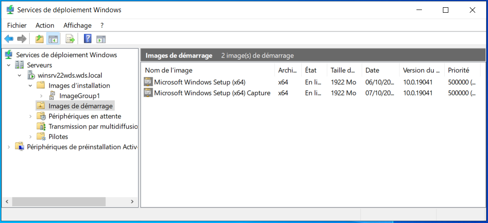
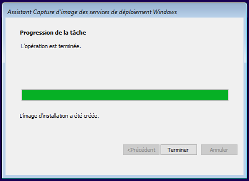
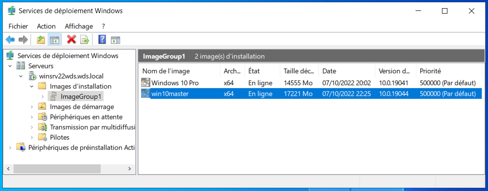

+++
archetype = "example"
title = "WDS - MDT"
weight = 1
+++

---

# WDS

Window Deployment System
---

**TP**

{}
Avec VMWare :
- 1 VM IPFire avec la carte "green" sur 192.168.13.0/24 en Host Only côté lan
- 1 VM Windows Server AD-DS + DHCP en Host Only
- 1 VM Windows CLient vierge en Host Only
{}

---

## 1 - Serveur AD-DS et DHCP

{}
- Une VM Windows Server 2022 avec :
    - 3-4 Go Ram
    - 1 DD 40 GO (C:)
    - 1 DD 60 GO (D:)
    - Host Only en 192.168.13.250/24 (fixe)
    - Rôle AD-DS puis
    - Rôle DHCP puis
    - Rôle WDS
{}

### Installation des rôle

Avant d'installer le moindre rôle, on s'assure de paramétrer le nom de la machine et sa carte réseau en IP fixe (192.168.13.250/24 ici) et on la reboot.

On installe d'abord le rôle AD-DS puis promotion en Domain Controler et configuration d'une forêt pour notre réseau local.

Ensuite vient le rôle DHCP et sa configuration.

Et enfin le rôle WDS et sa configuration :

>Durant l'installation, à l'étape de sélection des services de rôle, bien cocher les 2 options :
>
> - `Serveur de déploiement`  
et  
> - `Serveur de transport`

### Configuration initiale de WDS

- Une fois l'installation du rôle WDS achevée, dans le  Gestionnaire de serveur, menu Outils, choisir **Services de déploiement Windows**
- Cliquer droit sur le serveur pour le configurer (il a une icone d'alerte).
- La 1ère fenêtre rappelle les prérequis pour le service. *Suivant*
- Choisir **Intégré à Active Directory**. *Suivant*
- Entrer le chemin où les images seront stoquées. Lui indiquer de créer le dossier `RemoteInstall` à la racine du disque **D:** *Suivant*
- Choisir **Répondre à tous les ordinateurs clients (connus et inconnus)**. *Suivant*
- Attentre que la configuration se termine et une nouvelle fenêtre apparaît. Ne pas sélectionner "Ajouter les images au serveur maintenant" et *Terminer*



## Ajout d'images

Il faut ajouter une image d'un Windows qui servira de modèle pour nos futures déploiements :

- Ouvrir les "Settings" de la machine virtuelle (dans VMWare) et insérer l'iso souhaité dans le lecteur CD-ROm de la VM.
- Dans le gestionnaire WDS du serveur, sous le nom de notre serveur : clique droit sur **Images d'installation** > **Ajouter une image d'installation...**
- Créer un groupe d'images nommé : `nom_du_groupe` puis bouton *Suivant*
- *Parcourir* puis, dans le dossier **sources** du CD-Rom, sélectionner le fichier **install.wim** et *Suivant*
- Si l'ISO contient plusieurs versions, sélectionner uniquement celle que l'on souhaite en décochant les autres, puis *Suivant*
- L'assistant nous présente la version choisie, cliquer *Suivant*
- Après chargement du fichier, cliquer *Terminer*



- Répéter le même principe pour l'image de démarrage qui correspont au fichier **boot.wim** situé dans le même dossier du CD-Rom (pas de groupe ici).



{}
Pour une machine physique, il est possible que l’image de démarrage ne se charge pas du à une erreur de pilote, nous verrons plus loin comment ajouter des drivers aux services WDS et comment les intégrés aux images de démarrage et de capture.
{}

---

## 2 - CLient Windows 10 vierge

{}
Une VM Windows 10 vierge avec :
- 1-2 GO Ram
- 1 DD de 30 GO
- Host Only en DHCP
- UEFI *(sans problème à partir de WinSrv 2022)*
- Boot en PXE
- faire un snapshot pour éviter de recréer une VM pour chacun des tests.
{}

Démarrer la machine sans OS ni ISO dans le lecteur CD et attendre qu'elle boot en PXE.

Après choix de la langue et authentification (user@domaine.lan + mdp), l'installation doit démarrer comme avec une version CD ordinaire. Si tout se passe bien l'installation se poursuit jusqu'à la fin, WDS est fonctionnel !

---

## 3 - Optimisation avec un fichier de réponses

##### Prérequis :

- ADK et son outil WSIM (**Assitant Gestion d'Installation**)
- Une copie du fichier install.win (l'image) de notre version de Windows à configurer



Il faut d'abord ouvrir une image Windows : `Menu Fichier > Sélectionner l'image Windows` et indiquer le fichier **install.wim** puis la verion souhaitée et enfin Valider la création du catalogue. La zone en bas à gauche *(Image Windows)* doit se peupler.



### Créer un nouveau fichier de réponse

**Paramètres régionaux**

Ajouter les paramètres amd64_Microsoft-Windows-International-Core-WinPE et configurer les propriétés suivantes :

- InputLocale : fr-FR
- SystemLocale : fr-FR
- UILanguage : fr-FR
- UserLocale : fr-FR
- SeteupUILanguage / UILanguage : fr-FR

**Crédentials WDS**

Ajouter le paramètre WindowsDeploymentServices dans amd64_Microsoft-Windows-Setup et configurer les propriétés suivantes :

- Login / Credentials / Domain
- Login / Credentials / Password
- Login / Credentials / username

**Licence et fuseau horaire**

Ajouter le paramètre WindowsDeploymentServices dans amd64_Microsoft-Windows-Shell-Setup et configurer les propriétés suivantes :

- TimeZone : (GMT+01:00) Brussels, Copenhagen, Madrid, Paris
- OOBE / HideEULAPage : true
- OOBE / NetworkLocation : Work
- OOBE / SkipMachineOOBE : true
- OOBE / SkipUserOOBE : true

**Mot de passe de l’administrateur local**

Ajouter les paramètres UserAccounts qui se trouve dans amd64_Microsoft-Windows-Shell-Setup et configurer les propriétés suivantes :

- AdministratorPassword / Value : mot de passe

>Enregistrer le fichier de réponse en unatended.xml *(par exemple)*

Fichier de réponse complet :

`WDS_w10Pro_unatended.xml`



et son code xml :

```xml
<?xml version="1.0" encoding="utf-8"?>
<unattend xmlns="urn:schemas-microsoft-com:unattend">
    <settings pass="windowsPE">
        <component name="Microsoft-Windows-International-Core-WinPE" processorArchitecture="amd64" publicKeyToken="31bf3856ad364e35" language="neutral" versionScope="nonSxS" xmlns:wcm="http://schemas.microsoft.com/WMIConfig/2002/State" xmlns:xsi="http://www.w3.org/2001/XMLSchema-instance">
            <SetupUILanguage>
                <UILanguage>fr-FR</UILanguage>
            </SetupUILanguage>
            <InputLocale>fr-FR</InputLocale>
            <SystemLocale>fr-FR</SystemLocale>
            <UILanguage>fr-FR</UILanguage>
            <UILanguageFallback>fr-FR</UILanguageFallback>
            <UserLocale>fr-FR</UserLocale>
        </component>
        <component name="Microsoft-Windows-Setup" processorArchitecture="amd64" publicKeyToken="31bf3856ad364e35" language="neutral" versionScope="nonSxS" xmlns:wcm="http://schemas.microsoft.com/WMIConfig/2002/State" xmlns:xsi="http://www.w3.org/2001/XMLSchema-instance">
            <DiskConfiguration>
                <WillShowUI>OnError</WillShowUI>
                <Disk wcm:action="add">
                    <CreatePartitions>
                        <CreatePartition wcm:action="add">
                            <Order>1</Order>
                            <Size>500</Size>
                            <Type>Primary</Type>
                        </CreatePartition>
                        <CreatePartition wcm:action="add">
                            <Order>2</Order>
                            <Size>100</Size>
                            <Type>EFI</Type>
                        </CreatePartition>
                        <CreatePartition wcm:action="add">
                            <Order>3</Order>
                            <Size>16</Size>
                            <Type>MSR</Type>
                        </CreatePartition>
                        <CreatePartition wcm:action="add">
                            <Order>4</Order>
                            <Type>Primary</Type>
                            <Extend>true</Extend>
                        </CreatePartition>
                    </CreatePartitions>
                    <ModifyPartitions>
                        <ModifyPartition wcm:action="add">
                            <Format>NTFS</Format>
                            <Label>WinRE</Label>
                            <Order>1</Order>
                            <PartitionID>1</PartitionID>
                            <TypeID>DE94BBA4-06D1-4D40-A16A-BFD50179D6AC</TypeID>
                        </ModifyPartition>
                        <ModifyPartition wcm:action="add">
                            <Format>FAT32</Format>
                            <Label>System</Label>
                            <Order>2</Order>
                            <PartitionID>2</PartitionID>
                        </ModifyPartition>
                        <ModifyPartition wcm:action="add">
                            <Order>3</Order>
                            <PartitionID>3</PartitionID>
                        </ModifyPartition>
                        <ModifyPartition wcm:action="add">
                            <Format>NTFS</Format>
                            <Label>Windows</Label>
                            <Letter>C</Letter>
                            <Order>4</Order>
                            <PartitionID>4</PartitionID>
                        </ModifyPartition>
                    </ModifyPartitions>
                    <DiskID>0</DiskID>
                    <WillWipeDisk>true</WillWipeDisk>
                </Disk>
            </DiskConfiguration>
            <WindowsDeploymentServices>
                <Login>
                    <Credentials>
                        <Domain>wds.local</Domain>
                        <Password>1nfr@2022NG</Password>
                        <Username>Administrateur</Username>
                    </Credentials>
                </Login>
                <ImageSelection>
                    <InstallImage>
                        <Filename>install.wim</Filename>
                        <ImageGroup>ImageGroup1</ImageGroup>
                        <ImageName>Windows 10 Pro</ImageName>
                    </InstallImage>
                    <InstallTo>
                        <DiskID>0</DiskID>
                        <PartitionID>4</PartitionID>
                    </InstallTo>
                </ImageSelection>
            </WindowsDeploymentServices>
        </component>
    </settings>
    <settings pass="oobeSystem">
        <component name="Microsoft-Windows-International-Core" processorArchitecture="amd64" publicKeyToken="31bf3856ad364e35" language="neutral" versionScope="nonSxS" xmlns:wcm="http://schemas.microsoft.com/WMIConfig/2002/State" xmlns:xsi="http://www.w3.org/2001/XMLSchema-instance">
            <InputLocale>fr-FR</InputLocale>
            <SystemLocale>fr-FR</SystemLocale>
            <UILanguage>fr-FR</UILanguage>
            <UILanguageFallback>fr-FR</UILanguageFallback>
            <UserLocale>fr-FR</UserLocale>
        </component>
        <component name="Microsoft-Windows-Shell-Setup" processorArchitecture="amd64" publicKeyToken="31bf3856ad364e35" language="neutral" versionScope="nonSxS" xmlns:wcm="http://schemas.microsoft.com/WMIConfig/2002/State" xmlns:xsi="http://www.w3.org/2001/XMLSchema-instance">
            <OOBE>
                <HideEULAPage>true</HideEULAPage>
                <HideLocalAccountScreen>true</HideLocalAccountScreen>
                <HideOEMRegistrationScreen>true</HideOEMRegistrationScreen>
                <HideOnlineAccountScreens>true</HideOnlineAccountScreens>
                <HideWirelessSetupInOOBE>true</HideWirelessSetupInOOBE>
                <ProtectYourPC>1</ProtectYourPC>
            </OOBE>
            <UserAccounts>
                <AdministratorPassword>
                    <Value>MQBuAGYAcgBAADIAMAAyADIATgBHAEEAZABtAGkAbgBpAHMAdAByAGEAdABvAHIAUABhAHMAcwB3AG8AcgBkAA==</Value>
                    <PlainText>false</PlainText>
                </AdministratorPassword>
                <LocalAccounts>
                    <LocalAccount wcm:action="add">
                        <Password>
                            <Value>MQBuAGYAcgBAADIAMAAyADIATgBHAFAAYQBzAHMAdwBvAHIAZAA=</Value>
                            <PlainText>false</PlainText>
                        </Password>
                        <DisplayName>adissoir</DisplayName>
                        <Group>Administrateurs</Group>
                        <Name>adissoir</Name>
                    </LocalAccount>
                </LocalAccounts>
                <DomainAccounts>
                    <DomainAccountList wcm:action="add">
                        <Domain>wds.local</Domain>
                        <DomainAccount wcm:action="add">
                            <Group>Administrateurs</Group>
                            <Name>adissoir</Name>
                        </DomainAccount>
                    </DomainAccountList>
                </DomainAccounts>
            </UserAccounts>
            <AutoLogon>
                <Password>
                    <Value>MQBuAGYAcgBAADIAMAAyADIATgBHAFAAYQBzAHMAdwBvAHIAZAA=</Value>
                    <PlainText>false</PlainText>
                </Password>
                <Domain>wds.local</Domain>
                <Enabled>true</Enabled>
                <Username>adissoir</Username>
            </AutoLogon>
        </component>
    </settings>
    <cpi:offlineImage cpi:source="wim:c:/users/olivier/d/iso/windows_10_pro_cefim_21h2_fev22/sources/install.wim#Windows 10 Pro" xmlns:cpi="urn:schemas-microsoft-com:cpi" />
</unattend>
```


### Ajour du fichier de réponse à WDS

- Copier le fichier dans le dossier **`RemoteInstall`** du serveur WDS. 

- Depuis la console faire un clic droit sur le serveur et cliquer sur `Propriétés` > onglet `Client` et ajouter le fichier de réponse aux 2 sections de l'architecture adéquate (x86 ou x64) normale et UEFI. Puis Valider.


- Clique droit sur l'image et `Propriétés`. Sélectionner `Autoriser l'image à s'installer en mode sans assistance` et `Selectionner un fichier...` pour indiquer le fichier de réponse. Valider.


> Tester le fichier de réponse

---
### [Ajout de pilotes pour des machines réelles](https://rdr-it.com/wds-installation-et-configuration/9/)

---

## Créer une image de capture

Pour créer une capture d'une VM existante, il faut préparer le serveur et la machine à capturer.

*`Sur le serveur WDS`* :

Ajouter une image de capture (boot) sur le serveur :

Cliquer droit sur l'image de boot créée précédemment et choisir **Créer une image de capture...** ; lui donner un nom (capture), une description et lui indiquer le chemin du dossier partagé du serveur et un nom de fichier : `D:\RemoteInstall\WdsClientUnattend\capture.wim`.





*`Sur la machine à capturer`* :

- Aller dans le dossier `C:\Windows\system32\sysprep` et exécuter `sysprep.exe`

- Dans la fenêtre de sysprep, sélectionner **Audit** et **ne pas cocher Generalize**, et **Redémarrer** puis Valider.

Sysprep prépare la machine puis la reboot. Une fois redémarrée, installer sur la machine les logiciels à intégrer à l'image qui sera capturée.

Une fois tous les logiciels souhaités installés, relancer l'outil `sysprep` en choisissant **OOBE**, **Generalize** et **Eteindre** (`ne pas choisir redémarrer` ici, car la machine devra booter en PXE au prochain démarrage).

- À la fin de l'opération, la machine doit s'éteindre. La redémarrer en forçant le boot sur le firmware (BIOS/UEFI - avec l'option de démarrage `Power On to Firmware` de VMWare), et choisir le démarrage `Network` (PXE) pour que le serveur puisse l'intercepter.

Si demandé durant le boot PXE, appuyer sur F12 ou Entrée puis choisir l'option de boot **capture**.

L'Assistant de Capture d'image des services de déploiement Windows affiche une fenêtre de démarrage, cliquer `Suivant >`.

- 1 - `Répertoire à capturer`
    - Volume : **C:\\**
    - Nom de l'image : Un nom pour l'image capturée (**win10master**)
    - Description de l'image (**Windows 10 - Master**)
    - Cliquer `Suivant >`

- 2 - `Nouvel emplacement de l'image`
    - Nom et emplacement : Parcourir : **C:\\Users\Public\Documents\\** et `win10master` (.wim automatiquement ajouté).
    - **Cocher** Charger l'image sur un serveur[...]
    - Nom du serveur : Le nom ou l'adresse IP du serveur (**winsrv22wds**) puis `Connexion`
    Se rendre sur le serveur > AD Utilisateurs et Ordinateurs et Propriétés de l'utilisateur `Administrateur`, onglet Compte : indiquer **administrateur** et domaine (**wds.local**) puis valider
        - Nom d'utilisateur : **administrateur@wds.local**
        - Mot de passe : Le mote de passe de l'administrateur du serveur
        - `OK`
    - Si la connexion réussit, les groupes d'images du serveur sont chargées dans la liste déroulante : choisir celle souhaitée.
    - Cliquer `Suivant >`

- 3 - La capture de l'image démarre

- 4 - Une fois terminé, Cliquer `Terminer`



La machine redémarre et la nouvelle image d'installation apparaît dans le groupe choisi du Gestionnaire WDS sur le serveur.

Il ne reste plus qu'à lui créer son propre fichier de réponse à partir d'une copie du 1er ficher dont on modifie uniquement les propriétés propres à l'image WDS (Nom, Groupe et Nom de fichier), copier de xml sur le serveur dans `RemoteInstall\WdsClientUnattend\` et l'affecter à la nouvelle image par ses propriétés.



Lors du prochain déploiement, une nouvelle fenêtre apparaitra permettant de choisir l'image à déployer et proposant notre image nouvellement crée. Si le fichier de réponse est correct, l'installation se poursuivra sans intervention jusqu'au 1er login du système.

---

## Ajout de logiciel via une GPO dans AD

Il faut, en 1er lieu, intégrer la machine au domaine, et la placer dans une UO (par ex : `Ordinateurs`). Puis créer un dossier partagé accessible à tous les ordinateurs du domaine et tous les utilisateurs du domaine en Lecture et y placer le logiciel à déployer.

Dans la console Gestion des stratégies de groupe, créer une nouvelle GPO sur cette UO :
Configuration ordinateur/Stratégies/Paramètres du logiciel/ clique droit sur Installation de logiciel > Nouveau > Package...

Indiquer l'emplacement du logiciel **sur le réseau** (ex : \\WINSRV22WDS\Share) puis à l'onglet `Déploiement` indiquer le type **Attribué**. Valider et fermer le gestionnaire de GPO.

Patienter quelques minutes, le logiciel devrait s'installer sur les postes présents dans l'UO concernée.

*Il est toujours possible de forcer la mise à jour des stratégies via un terminal sur le poste client :*

```cmd
gpupdate /Force
```

---

# MDT

Microsoft Deployment Toolkit
---

## 1. [Déployer Windows avec WDS et MDT](https://rdr-it.com/deployer-windows-avec-mdt-et-wds/)

## 2. [MDT : utilisation avec une base de données](https://rdr-it.com/mdt-utilisation-base-de-donnees/)

## 3. [MDT installation des applications lors du déploiement de Windows](https://rdr-it.com/mdt-installation-des-applications-lors-du-deploiement-de-windows/)

## 4. [MDT : personnaliser les fenetres de l’assistant WinPE (LTI)](https://rdr-it.com/mdt-personnaliser-les-fenetres-de-lassistant-winpe-lti/)

---

## [Les bonnes pratiques ITIL lors de vos déploiements](https://openclassrooms.com/fr/courses/2013451-mettez-en-place-les-bonnes-pratiques-itil-lors-de-vos-deploiements)

---
