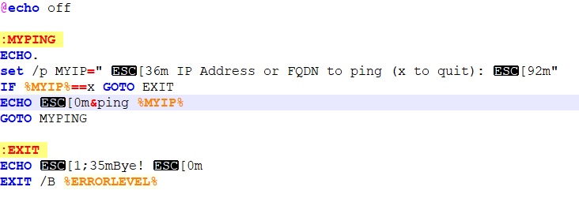
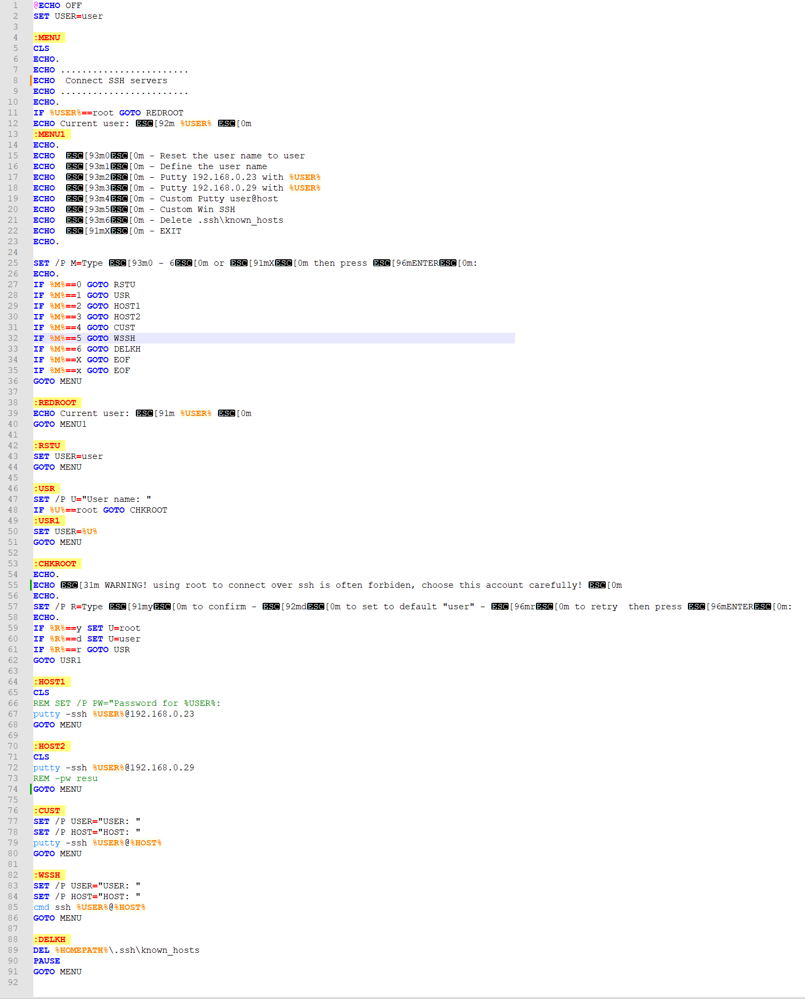

+++
archetype = "example"
title = "Batch"
weight = 1
+++

---

## **Scripts batch**

{}
Le caractère `ESC` dans le code s'obtient avec `ALT+027`.

*Il correpond au caractère d'échappement ASCII.*
{}

---

### 1. Simple ping

Simple script batch pour un outil de ping qui m'a permis d'expérimenter le rendu de couleur.

---

### 2. Connexion ssh

Un script offrant un menu permettant de choisir parmi différentes connexions ssh récurentes via cmd ou putty.

---
