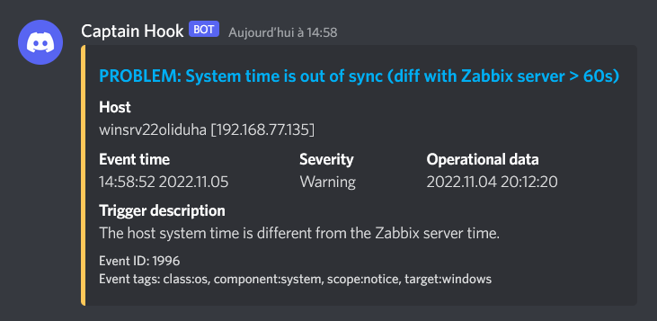

+++
archetype = "example"
title = "Zabbix"
weight = 1
+++

---

## Ressources

- [Installation de Zabbix](https://www.zabbix.com/download)
- [Tuto ultime d'installation Zabbix 6.2 sur Debian](https://bestmonitoringtools.com/how-to-install-zabbix-server-on-debian/)
- [Documentation webhook](https://www.zabbix.com/documentation/current/en/manual/config/notifications/media/webhook)
- [Supervision d'un NAS Synology via SNMP et Zabbix](https://www.tech2tech.fr/monitoring-5-supervision-dun-nas-synology-via-snmp/)
- [Une liste de tuto Zabbix](https://techexpert.tips/fr/zabbix-fr/zabbix-5-installation-sur-ubuntu-linux/)

---

*TP Cefim terminé avec succès :*

---
