+++
archetype = "example"
title = "AWS"
weight = 1
+++

## **Monter un serveur LAMPS avec NextCloud sur AWS**

## Préambule

- se connecter dans AWS
- se familiariser avec l’interface
- créer ou utiliser une AMI (amazon machine image) d’une debian 10
- créer une instance de cette ami en mode t2.micro
- se connecter dessus en ssh
- paramétrer le firewall de AWS pour les ports concernés (au moins 80,443,22...)
- Migrer le deb10 en deb11 avec la méthode dist-upgrade
- installer un service WEB APP de votre choix (Wordpress, GLPI, Nextcloud, Wiki….)
- sécuriser la solution (par ex : Fail2Ban)
- on doit pouvoir consulter votre service web par une ip publique et par le nom dns générique donné par AWS
- vous devrez enregistrer un vrai nom fqdn ans grâce à  votre hébergement ou domaine perso ou un service no-ip
- vous devez installer Let’s encrypt  via certbot:-)
- automatiser le renouvellement du certificat SSL/TLS tous les 3 mois via cron

## 1 - **Connexion à AWS et instanciation**

- Connexion au compte cefimaws / username / mdp fourni par cefim

- Connexion à la zone eu-west-2 (Londre)

- Création d'une instance
  - t2.micro
  - AMI debian 10 x86-x64 de juil-22 par FAI
  - 1 processeur
  - 1 GO RAM
  - 8 GO d'espace disque
  - enregistrement clés (username_key.pem)

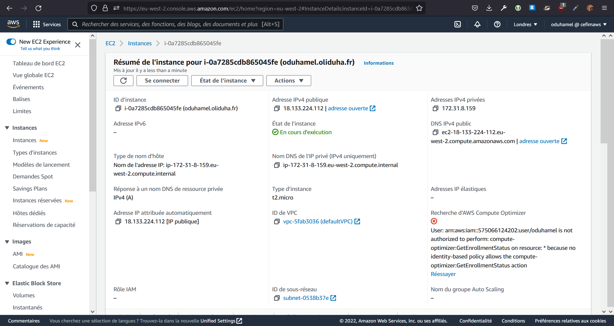

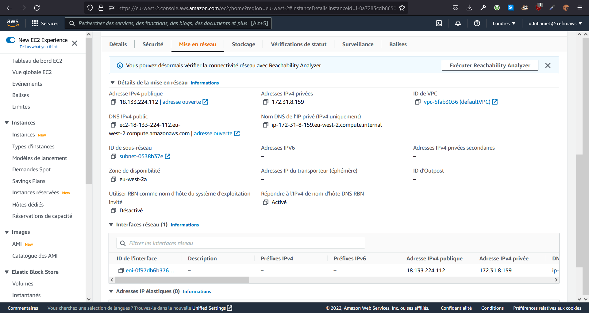

- configuration pare-feu AWS pour les ports nécessaires

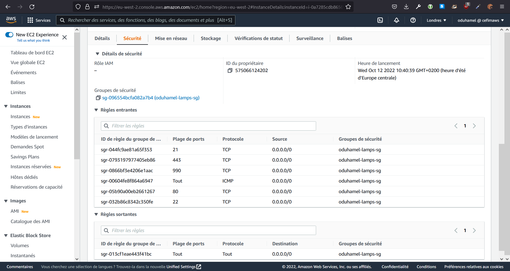

- Enregistrement FQDN (OVH) avec l'IP publique fournie par AWS 18.133.224.112 => oduhamel.oliduha.fr

## 2 - **Prise de contrôle en SSH**

- Connexion en ssh avec les clés fournies par AWS

```cmd
C:\Uers\Olivier>ssh -i _PEM\oduhamel_key.pem admin@oduhamel.oliduha.fr
```

- Connexion au compte root

```bash
sudo su -
```

- Changement du mot de passe root

```bash
passwd
```

## 3 - **Upgrade debian 10 => 11**

<https://www.cyberciti.biz/faq/update-upgrade-debian-10-to-debian-11-bullseye/>

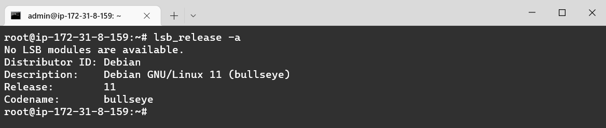

## 4 - **Iptables + iptables-persistent**

```bash
apt install iptables 
```

Ajout des règles nécessaires dans iptables 

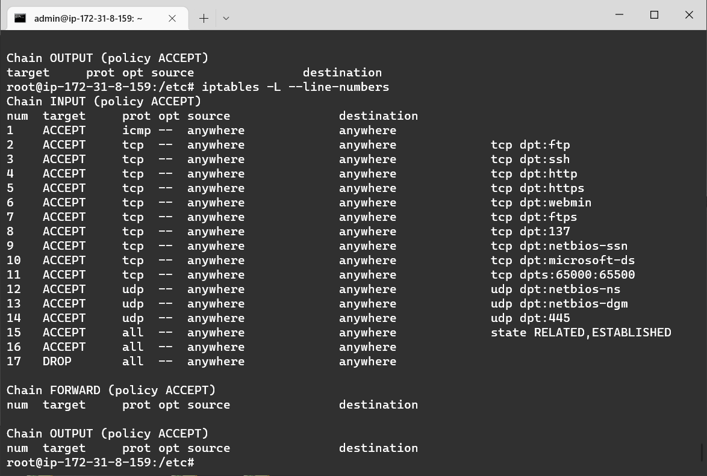

puis :

```bash
apt install iptables-persistent
```

Accepter la sauvegarde proposée durant l'installation va créer 2 fichiers qui seront automatiquement rechargés après un reboot :

>/etc/iptables/rules.v4  
/etc/iptables/rules.v6

Pour maj de ces fichier après modif :

```bash
iptables-save > /etc/iptables/rules.v4
```

*Nous travaillerons essentiellement en IPv4.*

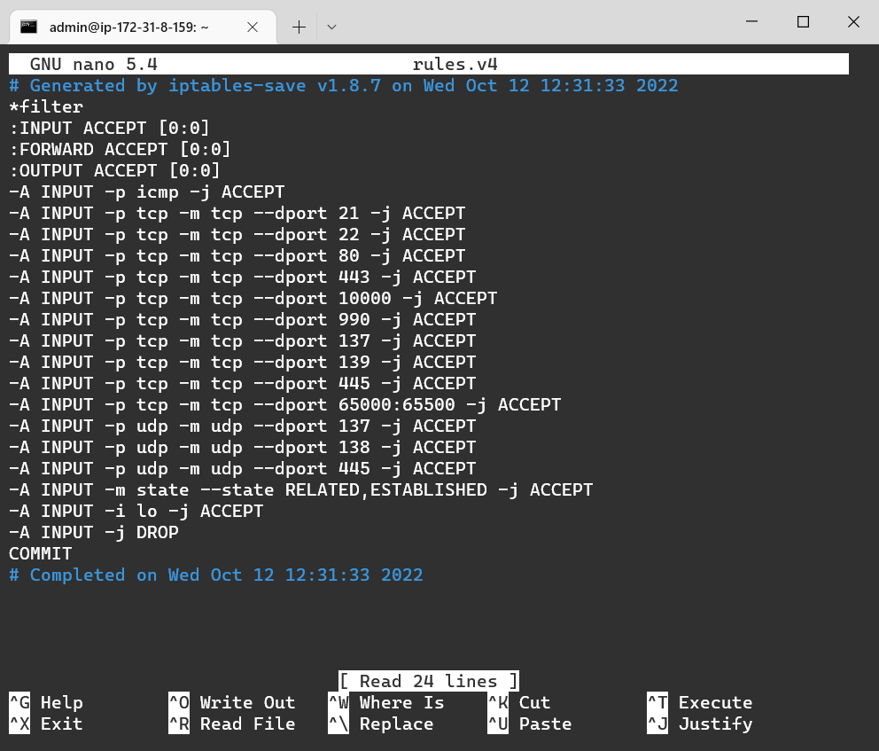

## 5 - **Apache**

Installer apache2 et activer les modules ssl, rewrite et headers.

```bash
apt install apache2

a2enmod ssl rewrite headers

service apache2 restart
```

## 6 - **Certificat Let's Encrypt**

**Créer un certificat debian pour apache** avec https://certbot.eff.org/

Une fois le certificat créé, on retrouve ses fichiers dans `/etc/letsencrypt/live/oduhamel.oliduha.fr/`

Il est aussi référencé dans le fichier .conf du site default-ssl d'apache

On regroupe les 2 configurations par défaut d'apache dans une seule

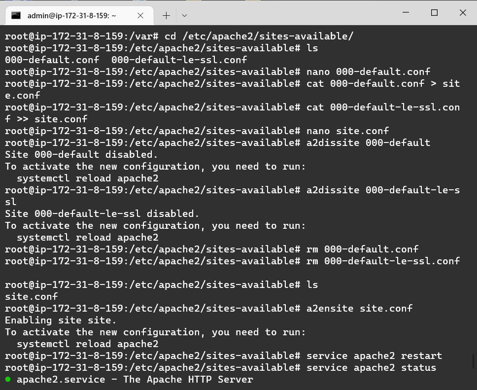

et on redémarre apache2

On automatise ensuite le renouvellement du certificat tous les 3 mois via crontab

```bash
crontab -e
```

et on ajoute :

```bash
0 0 1 */3 * certbot renew --apache --domain oduhamel.oliduha.fr -n
```

## 7 - **Mariadb**

installation de mariadb

```bash
apt install mariadb-server mariadb-client
```

puis

```bash
mysql_secure_installation
```

- passer le PW root [Enter]
- activer unix_socket authentication [Y]
- Indiquer ici un PW fort pour root et confirmer [...][...]
- Supprimer l'utilisateur anonyme [Y]
- désactiver le login à distance root  [Y]
- supprimer la base test [Y]
- actualiser la table des privilèges [Y]

Création BDD et User pour Nextcloud

```bash
mysql -u root -p
```

puis dans mariadb

```sql
CREATE DATABASE nextcloud_db;
CREATE USER nextclouduser@localhost IDENTIFIED BY 'StrongPassword';
GRANT ALL PRIVILEGES ON nextcloud_db.* TO nextclouduser@localhost;
FLUSH PRIVILEGES;
quit
```

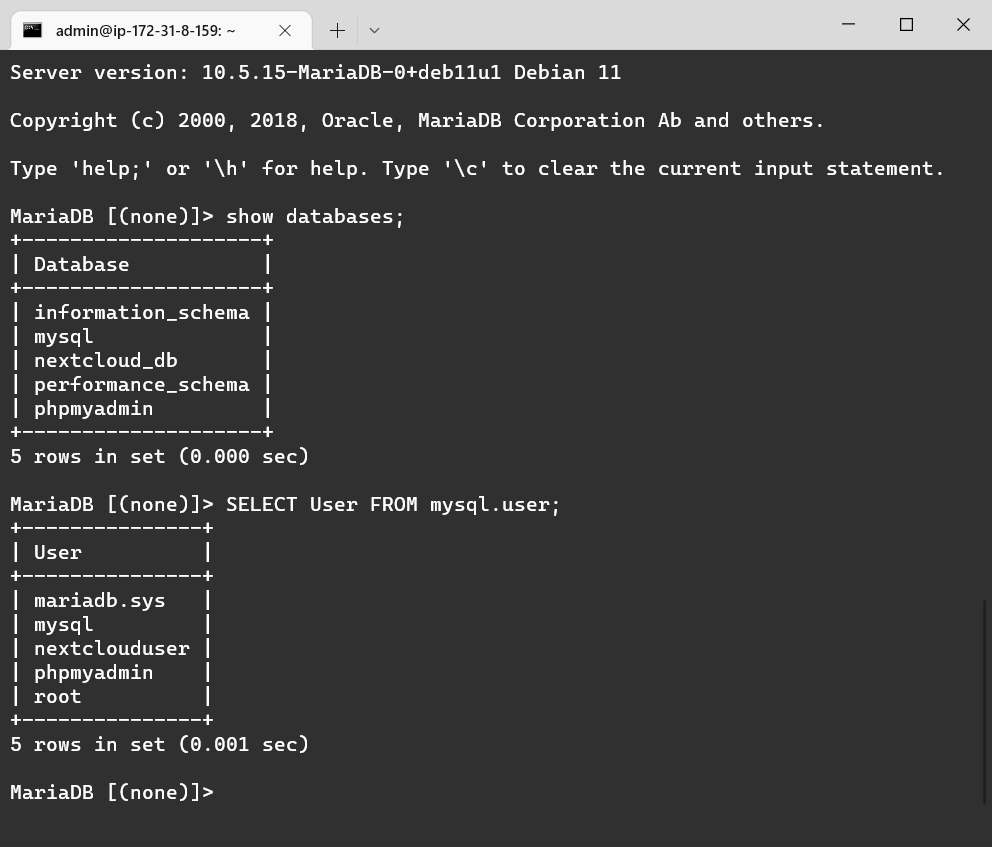

## 8 - **Php 8**

Ajout du repository php

```bash
echo "deb https://packages.sury.org/php/ $(lsb_release -sc) main"\ | sudo tee /etc/apt/sources.list.d/sury-php.list
```

Télécharger la clé GPG dans le dossier `/etc/apt/trusted.gpg`.d

```bash
curl -o /etc/apt/trusted.gpg.d/sury-php8.gpg https://packages.sury.org/php/apt.gpg

apt update
```

Installation de php et des bibliothèques nécéssaires :

```bash
apt install -y php php-curl php-cli php-mysql php-gd php-common php-xml php-json php-intl php-pear php-imagick php-dev php-common php-mbstring php-zip php-soap php-bz2 php-bcmath php-gmp php-apcu
```

puis :

```bash
apt install -y libmagickcore-dev
```

Edition du php.ini

```bash
cd /etc/php/8.0/apache2/
nano php.ini
```

Vérifier et modifier si besoin :
>file_uploads = On  
>allow_url_fopen = On  
>memory_limit = 512M  
>upload_max_filesize = 500M  
>post_max_size = 600M  
>max_execution_time = 300  
>display_errors = Off  
>date.timezone = Europe/Paris  
>output_buffering = Off  
>zend_extension=opcache

puis à la section `[OPCACHE]`

>opcache.enable = 1  
>opcache.interned_strings_buffer = 8  
>opcache.max_accelerated_files = 10000  
>opcache.memory_consumption = 128  
>opcache.save_comments = 1  
>opcache.revalidate_freq = 1

Sauvegarder et redémarrer le service apache2

## 9 - **Phpmyadmin**

Installation habituelle de phpmyadmin

## 10 - **Nextcloud**

- Téléchargement de Nextcloud latest.zip
- installation de unzip
- Décompression de l'archive dans `/var/www/nextcloud`

puis

```bash
chown -R www-data:www-data nextcloud
```

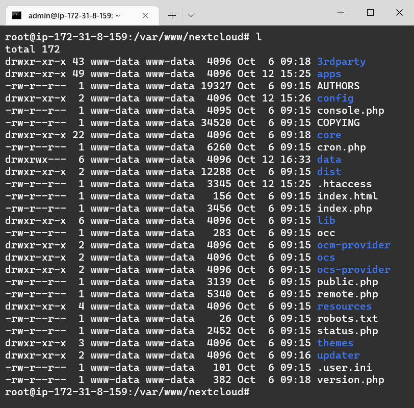

configuration et activation du site apache

```bash
cd /etc/apache2/sites-available/
cp site.conf nextcloud.conf
nano nextcloud.conf
```

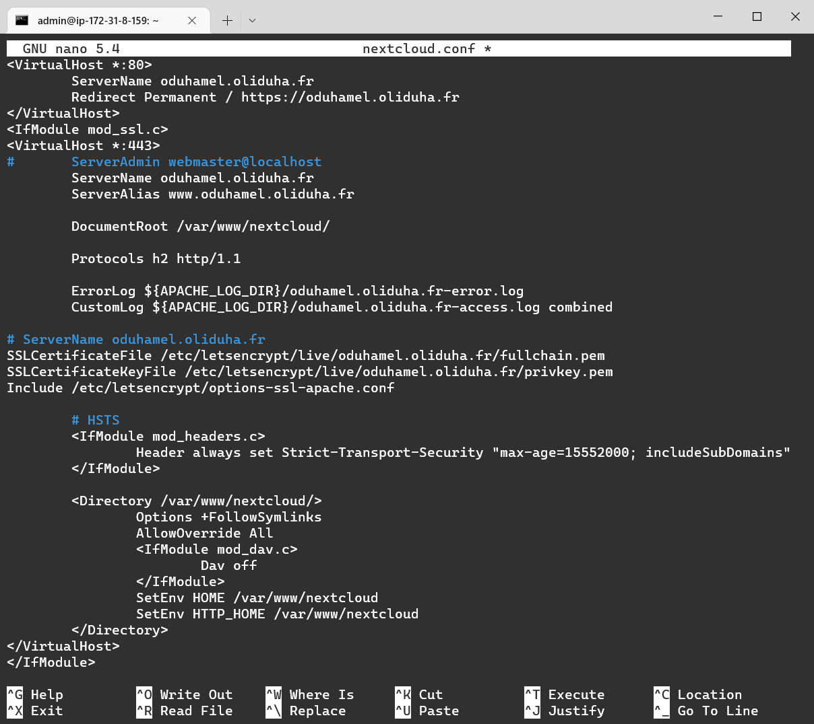

désactiver site.conf et activer nextcloud.conf

```bash
a2dissite site
a2ensite nextcloud.conf
```

tester la config et redémarrer le service apache2

```bash
apachectl configtest

systemctl restart apache2
```

La page de configuration de Nextcloud doit s'afficher dans le navigateur à l'URL :

>https://oduhamel.oliduha.fr

Créer un 1er utilisateur qui sera admin du site avec un mot de passe fort.
Si demandé, le dossier des données se trouve dans

>/var/www/nextcloud/data

plus bas, indiquer l'utilisateur ``nextclouduser`` créé précedemment dans mariadb, le PW associé et ``nextcloud_db`` pour la BDD ainsi que 'localhost'

La page renseignée et validée, on se log et on arrive sur l'interface de Nextcloud :

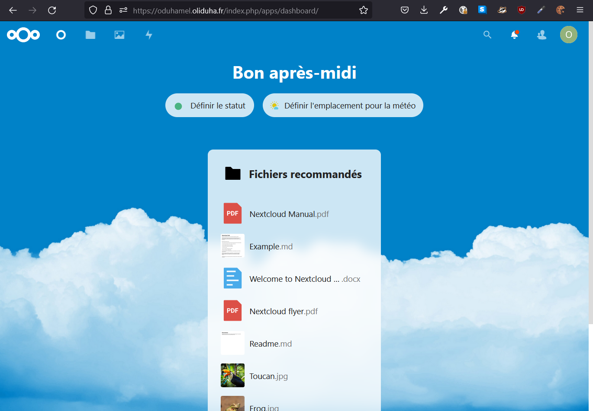

Parcourir les options de configurations pour régler plus finement la webapp

## 11 - **Sauvegarde automatique de la BDD**

Installer zip et créer un dossier pour stocker les sauvegardes

```bash
apt install zip
mkdir /root/backup
```

On crée un script bash dans le dossier /root/ pour automatiser la sauvegarde des fichiers et de la BDD de Nextcloud et on lui donne les droits d'exécution

```bash
cd root
touch backup.sh
chmod +x backup.sh
```

Puis on l'édite avec :

```bash
nano backup.sh
```

```bash
#!/bin/bash
# script de sauvegarde de la BDD nextcloud
echo Compression des fichiers...
zip -rq /root/backup/$(date +%Y%m%d%H%M)_nextcloud_backup_files.zip /var/www/nextcloud
echo Dump de la BDD...
mysqldump -u root -p '1nfr@2022NG' --database nextcloud_db > /root/backup/nextcloud_backup_bdd.sql
echo Compression de la BDD...
zip -q /root/backup/$(date +%Y%m%d%H%M)_nextcloud_backup_bdd.zip /root/backup/nextcloud_backup_bdd.sql
rm /root/backup/nextcloud_backup_bdd.sql
echo Terminé !
```

On automatise ensuite l'exécution de ce script via crontab pour faire une sauvegarde chaque vendredi soir.

```bash
crontab -e
```

et on y ajoute :

```bash
0 23 * * 5 /root/backup.sh
```

## 12 - **Fail2ban**

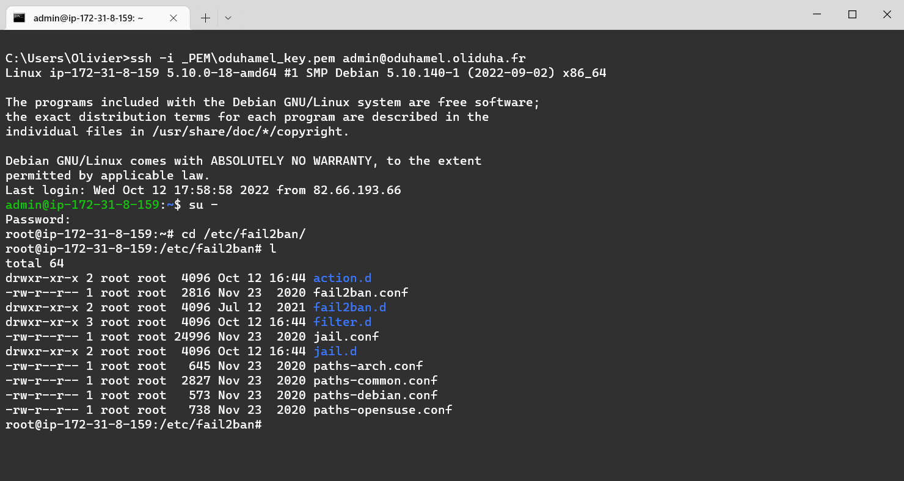

---

